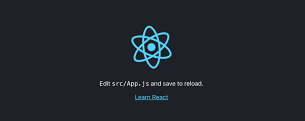

Since we’ll be building a Calculator app, let’s pick a scope that’s not too complicated for learning but also not too basic for covering different aspects of creating an app.

The features we’ll implement include:

+ add, subtract, multiply, divide
+ support decimal values
+ calculate percentages
+ invert values
+ reset functionality
+ format larger numbers
+ output resize based on length

---

## Setting Up the Project

To start, open the terminal in your projects folder and create a boilerplate template using the create-react-app. To do that, run the command:

```
npx create-react-app calculator
```
All you need to do after that is run `cd calculator` to switch to the newly created project folder and `npm start` to start your app in the browser.



As you can see, it comes with some default boilerplate, so next we’ll do some cleaning up in the project folder tree.

Find the src folder, where the logic of your app will live, and remove everything except App.js to create your app, index.css to style your app, and index.js to render your app in the DOM.


---
## Create Components

First create a `components` folder inside the `src` folder. We’ll then create a separate `.js file` and `.css file` for each component.

### Wrapper Component:

The Wrapper component will be the frame, holding all the children components in place. It will also allow us to center the whole app afterward.

+ Wrapper.js
```
import "./Wrapper.css";

const Wrapper = ({ children }) => {
  return <div className="wrapper">{children}</div>;
};

export default Wrapper;
```

+ Wrapper.css
```
.wrapper {
  width: 340px;
  height: 540px;
  padding: 10px;
  border-radius: 10px;
  background-color: #485461;
  background-image: linear-gradient(315deg, #485461 0%, #28313b 74%);
}
```

### Screen Component:

The Screen component will be the top section child of the Wrapper component, and its purpose will be to display the calculated values.

In the features list, we included display output resize on length, meaning longer values must shrink in size. We’ll use a small (3.4kb gzip) library called react-textfit for that.

To install it, run `npm i react-textfit` and then import and use it like shown below.

+ Screen.js
```
import { Textfit } from "react-textfit";
import "./Screen.css";

const Screen = ({ value }) => {
  return (
    <Textfit className="screen" mode="single" max={70}>
      {value}
    </Textfit>
  );
};

export default Screen;
```

+ Screen.css
```
.screen {
  height: 100px;
  width: 100%;
  margin-bottom: 10px;
  padding: 0 10px;
  background-color: #4357692d;
  border-radius: 10px;
  display: flex;
  align-items: center;
  justify-content: flex-end;
  color: white;
  font-weight: bold;
  box-sizing: border-box;
}
```

### ButtonBox Component: 

The ButtonBox component, similarly to the Wrapper component, will be the frame for the children — only this time for the Button components.

+ ButtonBox.js
```
import "./ButtonBox.css";

const ButtonBox = ({ children }) => {
  return <div className="buttonBox">{children}</div>;
};

export default ButtonBox;
```

+ ButtonBox.css
```
.buttonBox {
  width: 100%;
  height: calc(100% - 110px);
  display: grid;
  grid-template-columns: repeat(4, 1fr);
  grid-template-rows: repeat(5, 1fr);
  grid-gap: 10px;
}
```

### Button Component: 

The Button component will provide the interactivity for the app. Each component will have the value and onClick props.

+ Button.js
```
import "./Button.css";

const Button = ({ className, value, onClick }) => {
  return (
    <button className={className} onClick={onClick}>
      {value}
    </button>
  );
};

export default Button;
```

+ Button.css
```
button {
    border: none;
    background-color:rgb(127, 118, 180);
    font-size: 24px;
    color: rgb(255, 255, 255);
    font-weight: bold;
    cursor: pointer;
    border-radius: 10px;
    outline: none;
  }
  
  button:hover {
    background-color:  rgb(88, 81, 134);
  }
  
  .equals {
    grid-column: 3 / 5;
    background-color: rgb(240, 96, 70);
  }
  
  .equals:hover {
    background-color: rgb(228, 39, 15);
  }
```

---
## Render elements

The base file for rendering in React apps is `index.js`. Before we go further, make sure your `index.js` looks as follows:

```
import React from "react";
import ReactDOM from "react-dom";

import App from "./App";
import "./index.css";

ReactDOM.render(
  <React.StrictMode>
    <App />
  </React.StrictMode>,
  document.getElementById("root")
);
```

Also, let’s check `index.css` and make sure we reset the default values for `padding and margin`, pick some great font (like Montserrat in this case) and set the proper rules to center the app in the `viewport`:

```
@import url("https://fonts.googleapis.com/css2?family=Montserrat&display=swap");

* {
  margin: 0;
  padding: 0;
  font-family: "Montserrat", sans-serif;
}

body {
  height: 100vh;
  display: flex;
  align-items: center;
  justify-content: center;
  background-color: #fbb034;
  background-image: linear-gradient(315deg, #fbb034 0%, #ffdd00 74%);
}
```
Finally, let’s open the main file App.js, and import all the components we created previously:

```
import Wrapper from "./components/Wrapper/Wrapper";
import Screen from "./components/Screen/Screen";
import ButtonBox from "./components/ButtonBox/ButtonBox";
import Button from "./components/Button/Button";

const App = () => {
  return (
    <Wrapper>
      <Screen value={0} />
      <ButtonBox>
        <Button
          className=""
          value="0"
          onClick={() => {
            console.log("Button clicked!");
          }}
        />
      </ButtonBox>
    </Wrapper>
  );
};

export default App;
```
In the example above we have rendered just a single Button component.

Let’s create an array representation of the data in the wireframe, so we can map through and render all the buttons in the ButtonBox:

```
import Wrapper from "./components/Wrapper/Wrapper";
import Screen from "./components/Screen/Screen";
import ButtonBox from "./components/ButtonBox/ButtonBox";
import Button from "./components/Button/Button";

const btnValues = [
  ["C", "+-", "%", "/"],
  [7, 8, 9, "X"],
  [4, 5, 6, "-"],
  [1, 2, 3, "+"],
  [0, ".", "="],
];

const App = () => {
  return (
    <Wrapper>
      <Screen value=0 />
      <ButtonBox>
        {
          btnValues.flat().map((btn, i) => {
            return (
              <Button
                key={i}
                className={btn === "=" ? "equals" : ""}
                value={btn}
                onClick={() => {
                  console.log(`${btn} clicked!`);
                }}
              />
            );
          })
        }
      </ButtonBox>
    </Wrapper>
  );
};
```

Check your terminal and make sure your React app is still running. If not, run npm start to start it again.

Open your browser. If you followed along, your current result should look like this:


If you want, you can also open the browser’s devtools and test out the log values for each button pressed.


---

## Define states

Next, we’ll declare the state variables using React `useState` hook.

Specifically, there’ll be three states: `num`, the entered value; `sign`, the selected sign: and `res`, the calculated value.

In order to use the `useState` hook, we must first import it in `App.js`:
```
import React, { useState } from "react";
```

In the `App` function, we’ll use an object to set all states at once:
```
import React, { useState } from "react";

// ...

const App = () => {
  let [calc, setCalc] = useState({
    sign: "",
    num: 0,
    res: 0,
  });

  return (
    // ...
  );
};
```
---
## Functionality

Our app looks nice, but there’s no functionality. Currently, it can only output button values into the browser console. Let’s fix that!

We’ll start with the `Screen` component. Set the following conditional logic to `value` prop, so it displays the entered number (if the number is typed in), or the calculated result (if the equals button is pressed).

For that, we’ll use the built-in JS `ternary operator`, which is basically a shortcut for the `if` statement, taking in an expression and returning a value after `?` if the expression is true, or after `:` if the expression’s false:

```
<Screen value={calc.num ? calc.num : calc.res} />
```

Now let’s edit the `Button` component so it can detect different button types and execute the assigned function once the specific button is pressed. Use the code below:
```
import React, { useState } from "react";

// ...

const App = () => {
  // ...

  return (
    <Wrapper>
      <Screen value={calc.num ? calc.num : calc.res} />
      <ButtonBox>
        {btnValues.flat().map((btn, i) => {
          return (
            <Button
              key={i}
              className={btn === "=" ? "equals" : ""}
              value={btn}
              onClick={
                btn === "C"
                  ? resetClickHandler
                  : btn === "+-"
                  ? invertClickHandler
                  : btn === "%"
                  ? percentClickHandler
                  : btn === "="
                  ? equalsClickHandler
                  : btn === "/" || btn === "X" || btn === "-" || btn === "+"
                  ? signClickHandler
                  : btn === "."
                  ? commaClickHandler
                  : numClickHandler
              }
            />
          );
        })}
      </ButtonBox>
    </Wrapper>
  );
};
```
---
Now we’re ready to create all the necessary functions.

+ numClickHandler

The `numClickHandler` function gets triggered only if any of the number buttons (0–9) are pressed. Then it gets the value of the `Button` and adds that to the current `num` value.

It will also make sure that:

+ no whole numbers start with zero
+ there are no multiple zeros before the comma
+ the format will be “0.” if “.” is pressed first
+ numbers are entered up to 16 integers long

```
import React, { useState } from "react";

// ...

const App = () => {
  // ...

  const numClickHandler = (e) => {
    e.preventDefault();
    const value = e.target.innerHTML;

    if (calc.num.length < 16) {
      setCalc({
        ...calc,
        num:
          calc.num === 0 && value === "0"
            ? "0"
            : calc.num % 1 === 0
            ? Number(calc.num + value)
            : calc.num + value,
        res: !calc.sign ? 0 : calc.res,
      });
    }
  };

  return (
    // ...
  );
};
```

+ commaClickHandler

The `commaClickHandler` function gets fired only if the decimal point `(.)` is pressed. It adds the decimal point to the current `num` value, making it a decimal number.

It will also make sure that no multiple decimal points are possible.

```
// numClickHandler function

const commaClickHandler = (e) => {
  e.preventDefault();
  const value = e.target.innerHTML;

  setCalc({
    ...calc,
    num: !calc.num.toString().includes(".") ? calc.num + value : calc.num,
  });
};
```

+ signClickHandler

The `signClickHandler` function gets fired when the user press either `+, –, * or /.` The particular value is then set as a current `sign` value in the `calc` object.

It will also make sure that there’s no effect on repeated calls:

```
// commaClickHandler function

const signClickHandler = (e) => {
  e.preventDefault();
  const value = e.target.innerHTML;

  setCalc({
    ...calc,
    sign: value,
    res: !calc.res && calc.num ? calc.num : calc.res,
    num: 0,
  });
};
```

+ equalsClickHandler

The `equalsClickHandler` function calculates the result when the equals button `(=)` is pressed. The calculation is based on the current `num` and `res` value, as well as the `sign` selected (see the `math` function).

The returned value is then set as the new res for the further calculations.

It will also make sure that:

+ there’s no effect on repeated calls
+ users can’t divide with 0

```
// signClickHandler function

const equalsClickHandler = () => {
  if (calc.sign && calc.num) {
    const math = (a, b, sign) =>
      sign === "+"
        ? a + b
        : sign === "-"
        ? a - b
        : sign === "X"
        ? a * b
        : a / b;

    setCalc({
      ...calc,
      res:
        calc.num === "0" && calc.sign === "/"
          ? "Can't divide with 0"
          : math(Number(calc.res), Number(calc.num), calc.sign),
      sign: "",
      num: 0,
    });
  }
};
```

+ invertClickHandler

The `invertClickHandler` function first checks if there’s any entered value `(num)` or calculated value `(res)` and then inverts them by multiplying with -1:

```
// equalsClickHandler function

const invertClickHandler = () => {
  setCalc({
    ...calc,
    num: calc.num ? calc.num * -1 : 0,
    res: calc.res ? calc.res * -1 : 0,
    sign: "",
  });
};
```

+ percentClickHandler

The `percentClickHandler` function checks if there’s any entered value `(num)` or calculated value `(res)` and then calculates the percentage using the built-in `Math.pow` function, which returns the base to the exponent power:

```
// invertClickHandler function

const percentClickHandler = () => {
  let num = calc.num ? parseFloat(calc.num) : 0;
  let res = calc.res ? parseFloat(calc.res) : 0;

  setCalc({
    ...calc,
    num: (num /= Math.pow(100, 1)),
    res: (res /= Math.pow(100, 1)),
    sign: "",
  });
};
```

+ resetClickHandler

The `resetClickHandler` function defaults all the initial values of `calc`, returning the `calc` state as it was when the Calculator app was first rendered:

```
// percentClickHandler function

const resetClickHandler = () => {
  setCalc({
    ...calc,
    sign: "",
    num: 0,
    res: 0,
  });
};
```

---

## Input Formatting

One last thing to complete the feature list in the intro would be to implement value formatting. 

```
const toLocaleString = (num) =>
  String(num).replace(/(?<!\..*)(\d)(?=(?:\d{3})+(?:\.|$))/g, "$1 ");
```
Essentially what it does is take a number, format it into the string format and create the space separators for the thousand mark.

If we reverse the process and want to process the string of numbers, first we need to remove the spaces, so we can later convert it to number. For that, you can use this function:

```
const removeSpaces = (num) => num.toString().replace(/\s/g, "");
```

Here’s the code where you should include both functions:

```
import React, { useState } from "react";

// ...

const toLocaleString = (num) =>
  String(num).replace(/(?<!\..*)(\d)(?=(?:\d{3})+(?:\.|$))/g, "$1 ");

const removeSpaces = (num) => num.toString().replace(/\s/g, "");

const App = () => {
  // ...

  return (
    // ...
  );
};
```

---

## Putting It All Together

Now, the whole `App.js` code should look like this:

```
import React, { useState } from "react";

import Wrapper from "./components/Wrapper/Wrapper";
import Screen from "./components/Screen/Screen";
import ButtonBox from "./components/ButtonBox/ButtonBox";
import Button from "./components/Button/Button";

const btnValues = [
  ["C", "+-", "%", "/"],
  [7, 8, 9, "X"],
  [4, 5, 6, "-"],
  [1, 2, 3, "+"],
  [0, ".", "="],
];

const toLocaleString = (num) =>
  String(num).replace(/(?<!\..*)(\d)(?=(?:\d{3})+(?:\.|$))/g, "$1 ");

const removeSpaces = (num) => num.toString().replace(/\s/g, "");

const App = () => {
  let [calc, setCalc] = useState({
    sign: "",
    num: 0,
    res: 0,
  });

  const numClickHandler = (e) => {
    e.preventDefault();
    const value = e.target.innerHTML;

    if (removeSpaces(calc.num).length < 16) {
      setCalc({
        ...calc,
        num:
          calc.num === 0 && value === "0"
            ? "0"
            : removeSpaces(calc.num) % 1 === 0
            ? toLocaleString(Number(removeSpaces(calc.num + value)))
            : toLocaleString(calc.num + value),
        res: !calc.sign ? 0 : calc.res,
      });
    }
  };

  const commaClickHandler = (e) => {
    e.preventDefault();
    const value = e.target.innerHTML;

    setCalc({
      ...calc,
      num: !calc.num.toString().includes(".") ? calc.num + value : calc.num,
    });
  };

  const signClickHandler = (e) => {
    e.preventDefault();
    const value = e.target.innerHTML;

    setCalc({
      ...calc,
      sign: value,
      res: !calc.res && calc.num ? calc.num : calc.res,
      num: 0,
    });
  };

  const equalsClickHandler = () => {
    if (calc.sign && calc.num) {
      const math = (a, b, sign) =>
        sign === "+"
          ? a + b
          : sign === "-"
          ? a - b
          : sign === "X"
          ? a * b
          : a / b;

      setCalc({
        ...calc,
        res:
          calc.num === "0" && calc.sign === "/"
            ? "Can't divide with 0"
            : toLocaleString(
                math(
                  Number(removeSpaces(calc.res)),
                  Number(removeSpaces(calc.num)),
                  calc.sign
                )
              ),
        sign: "",
        num: 0,
      });
    }
  };

  const invertClickHandler = () => {
    setCalc({
      ...calc,
      num: calc.num ? toLocaleString(removeSpaces(calc.num) * -1) : 0,
      res: calc.res ? toLocaleString(removeSpaces(calc.res) * -1) : 0,
      sign: "",
    });
  };

  const percentClickHandler = () => {
    let num = calc.num ? parseFloat(removeSpaces(calc.num)) : 0;
    let res = calc.res ? parseFloat(removeSpaces(calc.res)) : 0;

    setCalc({
      ...calc,
      num: (num /= Math.pow(100, 1)),
      res: (res /= Math.pow(100, 1)),
      sign: "",
    });
  };

  const resetClickHandler = () => {
    setCalc({
      ...calc,
      sign: "",
      num: 0,
      res: 0,
    });
  };

  return (
    <Wrapper>
      <Screen value={calc.num ? calc.num : calc.res} />
      <ButtonBox>
        {btnValues.flat().map((btn, i) => {
          return (
            <Button
              key={i}
              className={btn === "=" ? "equals" : ""}
              value={btn}
              onClick={
                btn === "C"
                  ? resetClickHandler
                  : btn === "+-"
                  ? invertClickHandler
                  : btn === "%"
                  ? percentClickHandler
                  : btn === "="
                  ? equalsClickHandler
                  : btn === "/" || btn === "X" || btn === "-" || btn === "+"
                  ? signClickHandler
                  : btn === "."
                  ? commaClickHandler
                  : numClickHandler
              }
            />
          );
        })}
      </ButtonBox>
    </Wrapper>
  );
};

export default App;
```

# Congratulations! You’ve created a fully functional and styled app.