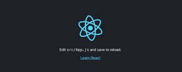
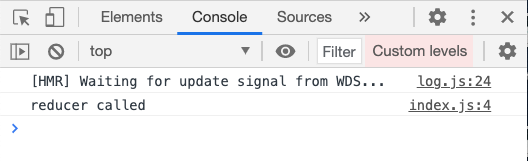
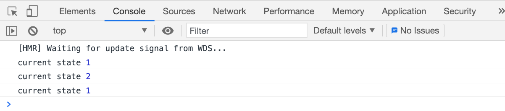
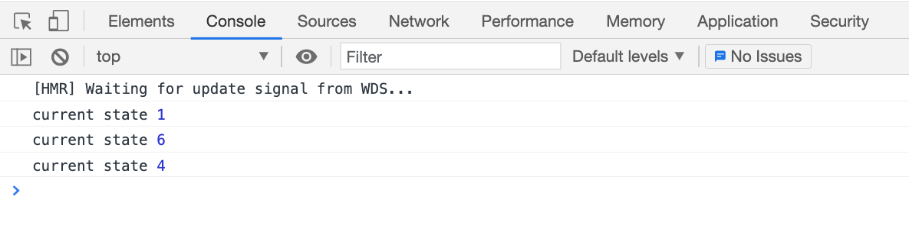
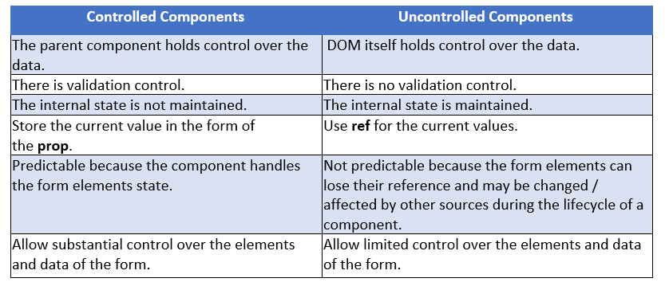

---
marp:true
---

## AGENDA

+ ReactJS - Introduction
+ Requirements and Tooling
+ Installing React
+ Creating a React Application
+ JSX
+ Components
+ React Styling
+ Props
+ State
+ React Fragments
+ Handling Events
+ Component Lifecycle
+ React Hooks
+ React Forms
+ React Ecosystem
+ React Interview Preparation

---

## ReactJS - Introduction

ReactJS is a JavaScript library for building user interface. 

Developed at Facebook and released to the world in 2013, it derives some of the most widely used apps, powering Facebook and Instagram among countless other applications.

---

### Features:

The salient features of React library are as follows:

+  Extensible architecture
+  Component based library
+  JSX based design architecture
+  Uses virtual DOM
+  Server- side rendering

---

## Requirements and Tooling

+ Requirements :
    + Text Editor (VS Code, Sublime Text, etc.)
    + HTML
    + CSS
    + JavaScript(ES6)

+ Tooling : 
    + Babel : Babel is a JavaScript compiler which compiles many variant (es2015, es6, etc.,) of JavaScript into standard JavaScript code supported by all browsers. 

    + Webpack : Webpack is a module bundler for JavaScript applications. Webpack recursively builds every module in your application, then packs all those modules into a small number of bundles.

---
## How to install React

To start with, there is one highly recommended approach and that's using the officially recommended tool called 

```
    create-react-app
```
`create-react-app` is a command line application, aimed to getting you up to speed with React in no time.

You start by using `npx`, which is an easy way to download and execute Node.js commands without installing them.

`npx` is a command line utitlity that comes bundled with `npm` (Node Package Manager) and is used to execute Node.js packages without installing them globally on your system.

If Node.js is not installed in your system, you can download and install by visiting:

```
    https://nodejs.org/en/download/
```
npm is installed with Node.

If you are unsure which version of npm you have, run ` node --version` to check if you need to update.

When you run `npx create-react-app <app-name>`, npx is going to download the most recent `create-react-app` release. This is great becuase you will never have an outdated version on your system, and every time you run it, you're getting the latest code available.

---

## Creating a React Application

+ Open a terminal and go to your workspace
```
     cd/go/to/your/workspace
```
+ Next, create a new React application
```
    npx create-react-app <demo-app>
```
It will create new folder `demo-app` with startup template code.

+ Next, go to `demo-app` folder and install the necessary library.

```
    cd demo-app
    npm install
```
The  `npm install` will install the necessary library under node_modules folder.

+ Next, start the application

```
    npm start
```
After the completion of `npm start` you will see:
```
Compiled successfully!

You can now view react-app in the web browser

Local :           http://localhost:3000

On your Network : http://192.168.56.1.3000

Note that the development build is not optimized.
To create a production build, use npm run build.
```
+ Next, open the browser and enter http://localhost/3000 in the address bar and press enter or you can press `Ctlr`+click on the link. The development web server will serve our webpages as shown below: 

---


---
+ Let us analyse the structure of our React application.

#### Files and Folders: 

```
    `-- node_modules
    `-- public
       |-- favicon.ico
       |-- index.html
       |-- logo192.png
       |-- logo512.png
       |-- manifest.json
       |-- robots.txt
    `-- src
       |-- App.css
       |-- App.js
       |-- App.test.js
       |-- index.css
       |-- logo.svg
       |-- reportWebVitals.js
       |-- setupTests.js
    `-- .gitignore
    `-- package.json
    `-- package-lock.json
    `-- README.md
```
+ package.json : The `package.json` is the core file representing the project. It configures the entire project and consists of project name, project dependencies, and commands to build and run the application.

+ The public folder : Contains the core file, index.html and other web resources like images, logos, robots, etc., `index.html` loads our react application and render it in user's browser. 

+ The src folder : Contains the actual code of the application.

---
## Source Code of the Application

Let us check the source code document of the application.

+ The index.js : Entry point of our application. It uses ReactDOM method to  start the application.

+ The index.css : Used to style the entire application.

+ App.js : Root component of our application.

+ App.css : Used to style the App component.

+ App.test.js : Used to write the unit test function for our component.

+ setupTests.js : Used to setup the testing framework for our application.

+ reportWebVitals.js : Generic web application startup code to support all browsers.

---

## React - JSX


JSX(JavaScript XML) is a syntax extension of JavaScript that allows you to write HTML -like code within their JavaScript components. 

+ JSX allows developers to write code that looks like HTMl, but is actually JavaScript. This means you can write code that is easier to read and understand than traditional JavaScript.

Here is an example:  

```
const element = <h1>Hello, world!</h1>;

```
- This code creates a new element that is a heading  with the text `Hello World`.

- Under the hood, JSX is transpiled to JavaScript code by tools like Babel by doing a process called `transpiling`.
- The above example is actually transpiled to something like this :

```
const element = React.createElement("h1", null, "Hello, world!");

```
- This code creates a new React element using `React.createElement()` method. The first argument is the name of the element, the second argument is the props(in this case, there are null), and the third argument is the content of the element.
---

## JSX Syntax : 

+ JSX syntax is similar to HTML but there are some differences. For example, in JSX, you must use `className` instead of `class` to define a CSS class.

```
// JSX

const element = <div className="container">Hello, world!</div>;

// HTML

<div class="container">Hello, world!</div>
```
+ JSX also allows to embed JavaScript expressions using curly braces `{}`:

```
const name = "Alice";
const element = <h1>Hello, {name}!</h1>;

```
- In this example, the value of the `name` variable is embedded in the JSX element.

+ JSX also supports iterating over arrays:
```
const numbers = [1, 2, 3, 4, 5];
const listItems = numbers.map((number) => <li>{number}</li>);
const element = <ul>{listItems}</ul>;
```
- In this example, the `listItems` variable is an array of `li` elements that display the values of the `numbers` array. The `element` variable is a `ul` element that contains the `listItems` array.

---
## ReactJS - Component

React Component is the building block of a React Application.

A React Component represents a small chunk of user interface in a webpage. The primary job of a React component is to render its user interface and update it whenever its internal state is changed. In addition to rendering the UI, it manages the events belongs to its user interface.

React component accomplish these features using three concepts:

+ Properties : Enables the component to recive input.
+ Events : Enable the component to manage DOM events and end-user-interaction. 
+ State : Enable the component to stay stateful. Stateful component updates its UI with respect to its state.

--- 

### Creating a React Component
React library has two component types. The types are categorized based on the way it is being created.

+ Function component - Uses plain JavaScript function.
+ ES6 class component - Uses ES6 class.

---

### The Core difference between function and class component are: 

+ Function component are very minimal in nature. Its only requirement is to return a React element.

```
function Hello(){
    return '<div>Hello</div>'
}
```
+ The same functionality can be done using class component with little extra coding.

```
class DemoExample extends React.Component{
    render(){
        return(
            <div>Hello</div>
        );
    }
}
```
+ Class components supports state management whereas function component does not support state management. But, React provides a hook, useState() for the function components to maintain its state.

+ Class component have a life cycle and access each life cycle events through dedicated callback apis. Function component does not have life cycle. Again, React provides a hook, useEffect() for the function component to access defferent stages of the component.

---

### Creating a Class Component 

```
import React, { Component } from 'react';

class MyComponent extends Component {
  constructor(props) {
    super(props);
    this.state = {
      message: 'Hello, World!'
    };
  }

  render() {
    return (
      <div>
        <h1>{this.state.message}</h1>
      </div>
    );
  }
}

export default MyComponent;
```
+ `import  React, {Component} from 'react'; ` imports the necessary modules to create a React component.
+ `class MyComponent extends Component{...}` defines the class component. `MyComponent` is the name of component and it extends the `Component` class provided by React.
+ The `constructor` method sets the initial state of the component. In this example, the state is an object with a single property `message` set to "Hello, World!".
+ The `render` method returns the JSX that defines the component's UI. In this example, it returns a `div` element containing an `h1` element with the text of the `message` state property.
+ `export default MyComponent;` exports the component so it can be used in other parts of the application.

---

### Creating a functional Component 

```
import React from 'react';

function MyComponent(props) {
  return (
    <div>
      <h1>Hello, {props.name}!</h1>
      <p>You are {props.age} years old.</p>
    </div>
  );
}

export default MyComponent;
```
+ This component is defined using the `function` keyword takes in a `props` object as an argument. 
+ Within the function, we use the `return` statement to define what the component will render.
+ In this example, the component returns a `<div>` element with an `<h1>` heading that displays a personalized greeting based on the `name` prop passed in,  as well as `<p>` element that displays the `age` prop passed in.

---

## React - Styling

In general, React allows component to be styled using CSS class through className attribute. Since, the React JSX supports JavaScript expression, a lot of common CSS methodology can be used. Some of the options are as follows: 

+ CSS stylesheet - Normal CSS styles along with className.
+ Inline styling - CSS styles as JavaScript objects along with camelCase properties.
+ CSS Modules - Locally scoped CSS styles.
+ Styled component - Component level styles.
+ Sass stylesheet - Supports Sass based CSS styles by converting the styles to normal css at build time.

---
Let us learn how to apply the three important methodology to style our component :

###  CSS Stylesheet

+ First create a new CSS file in your project. you can name it whatever you want, but for this example, we'll call it `styles.css`. In this file, you can define your CSS styles as you would for any other application.

```
.container {
    background-color: #fff;
    color: #000;
    padding: 10px;
    border-radius: 5px;
}
```
+ Next, you'll need to import the CSS file into your React component. You can do this by adding an `import` statement at the top of your component file.

```
import React from 'react';
import './styles.css';

const MyComponent = () => {
  return <div className="container">Hello World!</div>;
};

export default MyComponent;
```

---

### Inline Styling 

You can use inline styling to apply CSS directly to an element in your React component.

```
import React from 'react';

const MyComponent = () => {
  const styles = {
    backgroundColor: '#fff',
    color: '#000',
    padding: '10px',
    borderRadius: '5px',
  };

  return <div style={styles}>Hello World!</div>;
};

export default MyComponent;
```
---

### CSS Modules

CSS Modules allows you to locally scope your CSS styles by generating unique class names.

+ To create a CSS module, you need to create a file with the `.module.css` extension. For example, you could create a file called `MyComponent.module.css`. Inside this fil, you can define your CSS styles.

```
.container {
  background-color: #fff;
  color: #000;
  padding: 10px;
  border-radius: 5px;
}
```
+ Next, you'll need to import the CSS module into your React component. You can do this by adding an `import` statement at the top of your component file.

```
import React from 'react';
import styles from './MyComponent.module.css';

const MyComponent = () => {
  return <div className={styles.container}>Hello World!</div>;
};

export default MyComponent;
```
---

## React - Props(Properties)

React enables developers to create dynamic and advanced component using properties. Every component can have attributes similar to HTML attributes and each attribute's value can be accessed inside the component using properties(props).

We can access these properties inside a component as `this.props`.

For example, `Hello` component with a name attribute can be accessed inside the component through `this.props` variable.
```
<Hello name="React" />

const name = this.props.name
```

---

+ In a function component, props is all it gets passed, and they are available by adding `props` as the function argument:

```
const propExample = props => {
    return(
        <div>
            <h1>{props.title}</h1>
            <p>{props.description}</p>
        </div>
    )
}
```

+ In a class component, props are passed by default. There is no need to add anything special, and they are accessible as `this.props` in a Component instance.

```
import React, {Component} from 'react'

class propExample extends Component{
    render{
        render(
            <div>
                <h1>{this.props.title}</h1>
                <p>{this.props.description}</p>
            </div>
        )
    }
}
```
+ Passing props to components is a great way to pass values around in your application.

+ A component either holds data(has state) or receives data through its props.

+ We can also send functions as props, so a child component can call a function in the parent component.

+ A special prop is `children`. That contains the value of anything that is passed in the `body` of the component.

```
<Hello>Here is some message</Hello>
```
+ In this case, inside `Hello` we could access the value `Here is some message` by using `children` prop:

```
function Hello({children}){
    return <p>{children}</p>
}
```

---
+ Props are a way of communicating between parent and children components.

Suppose you have a parent component, which is a simple React function component that renders a child component:

```
function ParentComponent() {
  return (
    <div>
      <ChildComponent />
    </div>
  );
}

function ChildComponent() {
  return <h1>Hello, I am the Child Component</h1>;
}
```
Now, let's say we want to pass a message from the parent component to child component. To pass data from `ParentComponent` to the `ChildComponent`, we need to add a Props attribute to the ChildComponent : 

```
function ParentComponent() {
  return (
    <div>
      <ChildComponent message="Hello from Parent Component" />
    </div>
  );
}

function ChildComponent(props) {
  return <h1>{props.message}</h1>;
}
```

In this example, we've added a `Props` attribute called `message` to the `ChildComponent`. This Props attribute is passed as an object to the ChildComponent as a parameter, and it contains the value `Hello` from `Parent Component`. In the ChildComponent, we're accessing this value using `props.message` and rendering it inside an `h1` tag.

+ Props can be used to pass any kind of data between parent and child components, including strings, numbers, booleans, arrays, and objects.
+ Props are read-only. This means that you cannot modify the value of Props inside the child component. I

---

## React - State

Every React component has its own `state`.

The `state` is the set of data that is managed by the component.

The internal data represents the state of a React component and can be accessed using `this.state` memeber variable of the component. Whenever the state of the component is changed, the component will re-render itself by calling the `render()` method along with the new state.

For instance, In a form, each individual input element of the form is responsible for managing its state: what is written inside it. 

A button is responsible for knowing if it's being clicked, or not. 

A link is responsible for knowing if the mouse is hovering it.

---

### Setting the default state of a component

In the component constructor, initializing `this.state`.
For example the stateExample component might have a `clicked` state:

```
import React, { Component } from 'react';

class stateExample extends Component {
  constructor(props) {
    super(props);
    this.state = { clicked: false }
}

  render() {
    return (
      <div>
        <h1>Title</h1>
        <p>Description</p>
      </div>
    )
  }
}
```
### Accessing the state

The `clicked` state can be accessed by referencing `this.state.clicked`

```
import React, { Component } from 'react';

class stateExample extends Component {
  constructor(props) {
    super(props);
    this.state = { clicked: false }
}

  render() {
    return (
      <div>
        <h1>Title</h1>
        <p>Description</p>
        <p>Clicked: {this.state.clicked}</p>
      </div>
    )
  }
}
```

---
### Managing state using the `useState` utility provided by React: 

To use state in a React component, you need to define the initial state of the component using the `useState` hook. 

The `useState` hook returns an array with two elements - the current state value and a function to update the state.

You import `useState` from React this way:

```
import React, { useState } from 'react'
```

`useState()` accepts the initial value of the state item and returns an array containing the state variable, and the function you call to alter the state.

Example: 

```
const [count, setCount] = useState(0)
```
We can't alter the value of a state variable directly.
We must call its modifier function. Otherwise the React component will not update its UI to reflect the changes of the date. Calling the modifier is the way we can tell React that tha component state has changed.


Since `useState()` returns an array we use array destructing to access each individual item: like this:
`const [count, setCount] = useState(0)`

```
import React, { useState } from 'react';

function Counter() {
  const [count, setCount] = useState(0);

  function handleClick() {
    setCount(count + 1);
  }

  return (
    <div>
      <p>You clicked {count} times</p>
      <button onClick={handleClick}>
        Click me
      </button>
    </div>
  );
}
```
+ In this example, we have a `Counter` component that displays a `button` and a `counter`. 
+ The initial state of the counter is set to 0 using the `useState` hook. 
+ The `handleClick` function is called whenever the button is clicked, which updates the count state by incrementing it by 1 using the `setCount` function.
+ When the state is updated, React re-renders the component, and the new count value is displayed on the page.

---
### How to modify the value of a state?

To modify the value of a state variable using `setState` in React, you need to call `setState` with a new state object. 

```
import React, { Component } from 'react';

class Counter extends Component {
  constructor(props) {
    super(props);

    this.state = {
      count: 0
    };

    this.handleClick = this.handleClick.bind(this);
  }

  handleClick() {
    this.setState({
      count: this.state.count + 1
    });
  }

  render() {
    return (
      <div>
        <p>You clicked {this.state.count} times</p>
        <button onClick={this.handleClick}>
          Click me
        </button>
      </div>
    );
  }
}
```
+ In this example, we have a `Counter` component that uses `setState` to modify the value of the count state variable. 
+ The count state variable is initially set to `0` in the component's constructor.
+ The `handleClick` function is called whenever the button is clicked, which updates the value of the count state variable by incrementing it by `1` using `setState`. 
+ `setState` takes an object representing the new state and merges it with the current state object.
+ We pass an object with a new count property that is the result of incrementing the previous count value by 1. 
+ When `setState` is called, React updates the value of the count state variable and triggers a re-render of the component. This causes the new count value to be displayed on the page.

---
## React - Fragment

Developers had to use a `div` element as a `wrapper` for grouping multiple elements, which would add an unnecessary div element to the `DOM` tree.

With `React Fragment`, we can avoid this issue and keep the DOM tree clean.

`React Fragment` is a component that is used to group multiple elements and components into a single parent element, without introducing an extra DOM node.

For example, we'll create a simple component that renders a list of items. We'll use React Fragment to group the list items together, without adding an extra element to the DOM.

```
import React from 'react';

function ItemList(props) {
  const items = props.items.map(item => (
    <li key={item.id}>{item.name}</li>
  ));

  return (
    <React.Fragment>
      <h2>{props.title}</h2>
      <ul>{items}</ul>
    </React.Fragment>
  );
}

export default ItemList;
```
---
React Fragment also has a shorthand syntax `<></>` that is supported only in recent releases (and Babel 17+):

```
import React from 'react';

function ItemList(props) {
  const items = props.items.map(item => (
    <li key={item.id}>{item.name}</li>
  ));

  return (
    <>
      <h2>{props.title}</h2>
      <ul>{items}</ul>
    </>
  );
}

export default ItemList;
```
---
## React - Handling Events

React provides an easy way to handle events fired from DOM events.

Events are actions that occur when a user interacts with a web page.

These interactions can include clicking a button, scrolling, hovering over an element, or typing on a keyboard. 

Handling events with React elements is very similar to handling events on DOM elements.

There are some syntax differences:

+ React events are named using camelCase, rather than lowercase.
+ With JSX you pass a function as the event handler, rather than string.

For example, the HMTL : 

```
<button onclick="handleEvents()">
    Handle Events
</button>
```

in React:
```
<button onClick={handleEvents}>
    Handle Events
</button>
```
+ Another difference is that we can not return `false` to prevent default behavior in React. We must call `preventDefault` explicitly.

For example, with plain HTML, to prevent the default from behvaior of submitting, we can write:

```
<form onsubmit="console.log("you clicked submit"); return false">
<button type="submit">Submit</button>
</form>
```

In React, this could instead be:
```
function Form(){
    function handleSubmit(e){
        e.preventDefault();
        console.log("you clicked submit)
    }
    return(
        <form onSubmit={handleSubmit}>
            <button type="submit">Submit</button>
        </form>
    );
}
```
+ When using React, we generally don't need to call `addEventListener` to add listeners to a DOM element after it is created. Instead, just provide a listener when the element is initially rendered.

---
```
import React, { Component } from 'react';

class App extends Component {

  constructor(props) {
    super(props);

    this.state = {
      color: 'red'
    };

    this.handleButtonClick = this.handleButtonClick.bind(this);
  }

  handleButtonClick(event) {
    if (this.state.color === 'red') {
      this.setState({color: 'green'});
    } else {
      this.setState({color: 'red'});
    }
  }

  render() {
    return (
      <button onClick={this.handleButtonClick} style={{backgroundColor: this.state.color}}>
        Click me!
      </button>
    );
  }
}

export default App;
```
---
+ In the example, we have created a `button` that changes color when clicked. 
+ The color of the button is determined by the `state` of the component, which is initialized in the constructor function.
+ The `handleButtonClick` function is called when the button is clicked. This function checks the current color of the button and sets the state to the opposite color.
+ Finally, the button element includes the onClick event, which is set to the `handleButtonClick` function. This means that when the user clicks the button, the `handleButtonClick` function will be called, and the color of the button will change.

---
### The events reference
There are lots of events supported. Some commonly used are: 

+ Focus
    + onFocus
    + onBlur

+ Form
    + onChange
    + onInput
    + onSubmit

+ Mouse
    + onClick
    + onMouseDown
    + onMouseOver

---
## React - Component Lifecycle

In React, every component has a lifecycle, which refers to the series of events that happen from the initialization of a component to its removal from the DOM.

---

React lifecycle can be divided into three phases:

+ Mounting Phase: This phase begins when a component is created and inserted into the DOM. It consists of the following methods:

    + constructor: This is the first method that gets called when a component is created. It initializes the state and binds event handlers.

    + getDerivedStateFromProps: This method is called right after the constructor and before the render method. It updates the state based on the props received from the parent component.

    + render: This method is called after the getDerivedStateFromProps method. It returns the JSX that will be rendered in the DOM.

    + componentDidMount: This method is called after the render method. It is used for any side effect operations such as fetching data from an API, setting up event listeners or timers.

Here's an example of the Mounting phase:

```
import React, { Component } from 'react';

class App extends Component {
  constructor(props) {
    super(props);
    this.state = { count: 0 };
  }

  static getDerivedStateFromProps(props, state) {
    return { count: props.count };
  }

  componentDidMount() {
    console.log('Component mounted!');
  }

  render() {
    return <div>{this.state.count}</div>;
  }
}

export default App;
```
---
+ Updating Phase: This phase begins when a component's props or state changes. It consists of the following methods:

    + shouldComponentUpdate: This method is called before the render method. It determines if the component should be re-rendered or not based on the new props or state values.

    + getDerivedStateFromProps: This method is called after shouldComponentUpdate method and updates the state based on the new props.

    + render: This method is called after the getDerivedStateFromProps method. It returns the updated JSX that will be rendered in the DOM.

    + componentDidUpdate: This method is called after the render method. It is used for any side effect operations such as updating the DOM, fetching new data from an API, or setting up event listeners or timers.

Here's an example of the Updating phase:

```
import React, { Component } from 'react';

class App extends Component {
  constructor(props) {
    super(props);
    this.state = { count: 0 };
  }

  static getDerivedStateFromProps(props, state) {
    if (props.count !== state.count) {
      return { count: props.count };
    }
    return null;
  }

  shouldComponentUpdate(nextProps, nextState) {
    return nextProps.count !== this.props.count;
  }

  componentDidUpdate(prevProps, prevState) {
    console.log('Component updated!');
  }

  render() {
    return <div>{this.state.count}</div>;
  }
}

export default App;
```
---
+ Unmounting Phase: This phase begins when a component is removed from the DOM. It consists of the following method:
    + componentWillUnmount: This method is called just before the component is removed from the DOM. It is used for any cleanup operations such as removing event listeners or timers.

Here's an example of the Unmounting phase:

```
import React, { Component } from 'react';

class App extends Component {
  constructor(props) {
    super(props);
    this.state = { count: 0 };
  }

  componentWillUnmount() {
    console.log('Component unmounted!');
  }

  render() {
    return <div>{this.state.count}</div>;
  }

export default App;
```
---

## React - Hooks

React Hooks are functions that let you use React state and lifecycle features in functional components. Previously, only class components could use state and lifecycle methods. 

However, with the introduction of Hooks, functional components can now manage state and use other React features. This makes it easier to write and reuse code, as functional components are simpler and easier to test than class components.

---

There are several built-in Hooks available in React, including useState, useEffect, useContext, useReducer, useRef, and more. We will focus on the useState and useEffect Hooks.

+ useState Hook: The `useState` Hook lets you add state to functional components. It takes an initial state as a parameter and returns an array containing the current state value and a function to update the state. 

Here's an example:

```
import React, { useState } from 'react';

function Counter() {
  const [count, setCount] = useState(0);

  return (
    <div>
      <p>You clicked {count} times</p>
      <button onClick={() => setCount(count + 1)}>Click me</button>
    </div>
  );
}
```
+ In the above example, we are using the `useState` Hook to add state to our functional component. We initialize the count state to 0, and we also define a function called setCount, which updates the count state.

+ When the user clicks the button, the setCount function is called with the new count value, and the component re-renders with the updated count value.

---
+ useEffect Hook: The `useEffect` Hook lets you perform side effects in functional components. Side effects are any operation that affects something outside the component, such as modifying the DOM or fetching data from an API.

+ The useEffect Hook takes two parameters: `a function that performs the side effect`, and `an array of dependencies that determine when the effect should be triggered`.

 Here's an example:

 ```
 import React, { useState, useEffect } from 'react';

function FetchData() {
  const [data, setData] = useState([]);

  useEffect(() => {
    fetch('https://jsonplaceholder.typicode.com/users')
      .then(response => response.json())
      .then(data => setData(data));
  }, []);

  return (
    <ul>
      {data.map(user => (
        <li key={user.id}>{user.name}</li>
      ))}
    </ul>
  );
}
```
+ In the above example, we are using the `useEffect` Hook to fetch data from an `API` and update the component state with the fetched data.
+ We define a function that performs the fetch operation, and we pass it to the `useEffect` Hook as the first parameter.
+ We also pass an empty array as the second parameter, which means that the effect should only be triggered once when the component mounts. This is because we only want to fetch the data once and not on every re-render of the component.

---

+ useRef Hook : The `useRef` is a hook that allows to directly create a reference to the `DOM element` in the functional component. 

The syntax for the useRef hook is as follows:
```
const refContainer = useRef(initialValue);
```
+ `refContainer` is the reference object that is created by the `useRef` hook.
+ `initialValue` is the initial value of the reference object. This is optional and defaults to undefined.

Here's an example:

```
import React, { useRef } from 'react';

function Example() {
  const inputRef = useRef(null);

  function handleClick() {
    inputRef.current.focus();
  }

  return (
    <div>
      <input type="text" ref={inputRef} />
      <button onClick={handleClick}>Focus Input</button>
    </div>
  );
}
```
+ In this example, we're using the `useRef` hook to create a reference to the input element. We're also defining a function `handleClick` that uses the current property of the `inputRef` to focus on the input element when the button is clicked.

+ When the component renders for the first time, the `useRef` hook creates a reference object `inputRef` with an `initial value of null`.

+ The `ref` attribute on the input element is set to `inputRef`. This means that when the input element is mounted, the `inputRef` will be updated with a reference to the input element.

+ When the button is clicked, the `handleClick` function is called. The current property of the `inputRef` is used to access the input element and call its `focus()` method, which sets the focus on the input element.

+ Since the `inputRef` reference object persists between renders, we can use it to access the input element even after the component re-renders.

---

## React - Forms

Forms are an essential part of any web application. They were designed to allow the user to interact with a page.

Common uses of forms?

+ Search
+ Contact forms
+ Shopping carts checkout
+ Login and registration
+ and more!

Using React we can make our forms much more interactive and less static.

There are two main ways of handling forms in React, which differ on a fundamental level: how data is managed.

+ if the data is handled by the DOM, we call them `uncontrolled components`.
+ if the data is handled by the components we call them `controlled components`.

---
### Controlled Components:

One way to handle forms in React is by using controlled components. In this approach, the form input values are controlled by the React component state, and the input elements receive their values from the state. Any changes made to the input elements trigger a change in the state, which in turn updates the input element.

Here is an example of a controlled component form:

```
import React, { useState } from 'react';

function Form() {
  const [name, setName] = useState('');
  const [email, setEmail] = useState('');

  function handleSubmit(event) {
    event.preventDefault();
    console.log('Name:', name);
    console.log('Email:', email);
  }

  return (
    <form onSubmit={handleSubmit}>
      <label>
        Name:
        <input type="text" value={name} onChange={(event) => setName(event.target.value)} />
      </label>
      <label>
        Email:
        <input type="email" value={email} onChange={(event) => setEmail(event.target.value)} />
      </label>
      <button type="submit">Submit</button>
    </form>
  );
}
```
+ In the above example, we use the `useState` hook to create two state variables, name and email. 
+ The form input values are controlled by these state variables. 
+ The handleSubmit function is called when the form is submitted, and it logs the name and email values to the console.

---
### Uncontrolled Components:

Another way to handle forms in React is by using uncontrolled components. In this approach, the form input values are not controlled by the React component state. Instead, the input elements have their own state, and the form data is accessed using a ref.

Here is an example of an uncontrolled component form:

```
import React, { useRef } from 'react';

function Form() {
  const nameInput = useRef();
  const emailInput = useRef();

  function handleSubmit(event) {
    event.preventDefault();
    console.log('Name:', nameInput.current.value);
    console.log('Email:', emailInput.current.value);
  }

  return (
    <form onSubmit={handleSubmit}>
      <label>
        Name:
        <input type="text" ref={nameInput} />
      </label>
      <label>
        Email:
        <input type="email" ref={emailInput} />
      </label>
      <button type="submit">Submit</button>
    </form>
  );
}
```
+ In the above example, we use the `useRef` hook to create two ref objects, nameInput and emailInput.
+ The form input values are not controlled by the component state, and are accessed using the current property of the ref object. 
+ The `handleSubmit` function is called when the form is submitted, and it logs the name and email values to the console.

---
## React Ecosystem

### React - Routing

Routing in React enables us to navigate between different pages or components within a single-page application (SPA) without the need for a full page refresh.

### React as a Single Page Application (SPA):

In non-single page applications, when you click on a link in the browser, a request is sent to the server before the HTML page gets rendered.

In React, the page contents are created from our components. So what React Router does is intercept the request being sent to the server and then injects the contents dynamically from the components we have created. This is the general idea behind SPAs which allows content to be rendered faster without the page being refreshed.

---
## How to Install React Router

To install React Router, all you have to do is run 
```
    npm install react-router-dom
``` 
in your project terminal and then wait for the installation to complete.

## How to Set Up React Router

+ The first thing to do after installation is complete is to make React Router available anywhere in your app.

+ To do this, open the `index.js` file in the `src` folder and import `BrowserRouter` from `react-router-dom` and then wrap the `root component` (the App component) in it.

+ This is what the `index.js` looked like initially:

```
import React from 'react';
import ReactDOM from 'react-dom';
import './index.css';
import App from './App';

ReactDOM.render(
  <React.StrictMode>
    <App />
  </React.StrictMode>,
  document.getElementById('root')
);
```

+ After making changes with React Router, this is what you should have:

```
import React from 'react';
import ReactDOM from 'react-dom';
import './index.css';
import App from './App';
import { BrowserRouter } from "react-router-dom";

ReactDOM.render(
  <BrowserRouter>
    <App />
  </BrowserRouter>,
  document.getElementById("root")
);
```
+ All we did was replace `React.StrictMode` with `BrowserRouter` which was imported from `react-router-dom`.  Now the `router` features are accessible from any part of your app.

---
## How to Route to Other Components

+ Step:1 -  Create multiple components.

We'll create the following `Home`, `About`, and `Contact` components like this:

### Home Component 
```
function Home() {
  return (
    <div>
      <h1>This is the home page</h1>
    </div>
  );
}

export default Home;
```
### About Component
```
import React from 'react'

function About() {
    return (
        <div>
            <h1>This is the about page</h1>
        </div>
    )
}

export default About
```
### Contact Component
```
import React from 'react'

function Contact() {
    return (
        <div>
            <h1>This is the contact page</h1>
        </div>
    )
}

export default Contact
```
---
+ Step:2 - Define `routes`

Since the `App component` acts as the root component where our React code gets rendered from initially, we will be creating all our routes in it.

### App Component

```
import { Routes, Route } from "react-router-dom"
import Home from "./Home"
import About from "./About"
import Contact from "./Contact"

function App() {
  return (
    <div className="App">
      <Routes>
        <Route path="/" element={ <Home/> } />
        <Route path="about" element={ <About/> } />
        <Route path="contact" element={ <Contact/> } />
      </Routes>
    </div>
  )
}

export default App
```
+ We first imported the features we'll be using – `Routes` and `Route`. After that, we imported all the components we needed to attach a route to. 

+ `Routes` acts as a container/parent for all the individual routes that will be created in our app.

+ `Route` is used to create a single route. It takes in two attributes:

    + `path`: specifies the URL path of the desired component. You can call this pathname whatever you want. Any component whose pathname is a backslash will get rendered first whenever the app loads for the first time. This implies that the Home component will be the first component to get rendered.

    + `element`: specifies the component the route should render.

---
+ Step:3 - Use `Link` to navigate to routes

We will now use a different React Router feature to navigate to other pages based on those routes and pathnames we created in the `App` component. That is:

### Home Component

```
import { Link } from "react-router-dom";

function Home() {
  return (
    <div>
      <h1>This is the home page</h1>
      <Link to="about">Click to view our about page</Link>
      <Link to="contact">Click to view our contact page</Link>
    </div>
  );
}

export default Home;
```
The `Link` component is similar to the `anchor` element in HTML. Its `to` attribute specifies which path the link takes you to.

---
## Redux 

Redux is a state management library that helps you better manage state in your applications.

+ As an application grows, it becomes difficult to keep it organized and maintain data flow. That is where Redux comes to the rescue.

+ State transfer between components is pretty messy in React since it is hard to keep track of which component the data is coming from. It becomes really complicated if users are working with a large number of states within an application.

+ Redux solves the state transfer problem by storing all of the states in a single place called a store. So, managing and transferring states becomes easier as all the states are stored in the same convenient store. Every component in the application can then directly access the required state from that store.

## Principles of Redux:

The three most important Redux principles are:

### Single Source of Truth :

+ The state of your whole application is stored in an object tree within a single store. As whole application state is stored in a single tree, it makes debugging easy, and development faster.

### State Is Read-Only :

+ The only way to change the state is to emit an action, an object describing what happened. This means nobody can directly change the state of your application.

### Changes are made with pure functions :

+ To specify how the state tree is transformed by actions, you write pure reducers. A reducer is a central place where state modification takes place. Reducer is a function which takes state and action as arguments, and returns a newly updated state.

---
## Pillars of Redux 

### Store :
A store is an object that holds the application's state tree. There should only be a single store in a Redux app, as the composition happens at the reducer level.

+ `getState()` returns the current state of the store.

```
console.log("store.getState()");
```
+ `dispatch()` dispatches an action. It is the only way to update the application state.

```
store.dispatch({type:'ITEMS_REQUEST'})
```

+ `subscribe()` subscribes a change listener to the state.

```
store.subscribe(()=>{ console.log(store.getState());})
```

+ `unsubscribe()` is useful when you no longer want to call your listener method when the state changes.

```
const unsubscribe = store.subscribe(()=>{console.log(store.getState());});
unsubscribe();
```

### Action :

An action is a plain object that represents an intention to change the state. They must have a property to indicate the type of action to be carried out.

+ Actions are payloads of information that send data from your application to your store.

+ Any data, whether from UI events or network callbacks, needs to eventually be dispatched as actions.

+ Actions must have a type field, indicating the type of action being performed.

### Reducers :

Reducers are `pure functions` that specify how the application's state changes in response to actions sent to the store.

+ Actions only describe what happened, not how the application's state changes.

+ A reducer is a function that accepts the current state and action, and returns a new state with the action performed.

+ `combineReducers()` utility can be used to combine all the reducers in the app into a single index reducer which makes maintainability much easier.

---

## Redux - Installation

To add Redux to a React application , you need to install the redux and react-redux packages, which can be done by running the following command in the terminal:

```
npm install --save redux react-redux
```

---

### Let's create a new React project

+ Execute the following command in the terminal/command prompt to create a new React project using `create-react-app`:

```
npx create-react-app redux-demo
```

+ Once you've created the project, delete all the files from the `src` folder and create a new file `index.js` inside the `src` folder.

### How to Create the Redux Store

+ In Redux, you use the store to manage and track the data that's changing in the application.

+ To create a store, we need to import the `createStore` function like this:

```
import { createStore } from 'redux';
```

+ The createStore function accepts three arguments:

    + The first argument is a function that is normally known as a reducer (required).
    + The second argument is the initial value of the state (optional).
    + The third argument is an enhancer where we can pass middleware, if any (optional).

```
import { createStore } from 'redux';

const reducer = (state, action) => {
  console.log('reducer called');
  return state;
};

const store = createStore(reducer, 0);
```
Here, we've first defined a reducer function using arrow function syntax.

+ Inside the `reducer` function, we're logging some text to the `console` and then returning the value of the state from the function.

+ Then we pass that reducer function to the `createStore` function as the first argument and `0` as the initial value of the state as the second argument.

+ The `createStore` function returns a store that we can use to manage the application data.

+ The `reducer` function receives `state` and `action` as the parameters.

+ The initial value of the state which we passed as `0` for the `createStore` function is automatically passed as the value of the state parameter.

But it's a much more common practice to initialize the `state` inside the `reducer` itself rather than passing it as a second argument to the `createStore` function like this:

```
import { createStore } from 'redux';

const reducer = (state = 0, action) => {
  console.log('reducer called');
  return state;
};

const store = createStore(reducer);
```
Once the store is created, we can use the `subscribe` method provided by the store to subscribe to the changes in the store as shown below:

```
store.subscribe(() => {
  console.log('current state', store.getState());
});
```

Here, using the `subscribe` function, we're registering a `callback` function that will be called once the store is changed.

And inside the `callback` function, we're calling the `store.getState` method to get the `current value` of the state.

+ Now, open the `src/index.js` file and add the following contents inside it:

```
import { createStore } from 'redux';

const reducer = (state = 0, action) => {
  console.log('reducer called');
  return state;
};

const store = createStore(reducer);

store.subscribe(() => {
  console.log('current state', store.getState());
});
```

Now, if you run the application by executing the `npm start` command from the terminal and access `http://localhost:3000/`, you will see the reducer called message printed in the console.

---


This is because the `reducer` gets called immediately once we pass it to the `createStore` function.

---
### How to Change the Store

Now we're done with creating the store. But the store is not much use to us right now. This is because the store is connected using the reducer function, but we have not added any code inside the reducer to manage the store.

+ The only way to change the store is by dispatching `actions`.

An action is an object sent to the store like this:
```
store.dispatch({
  type: 'INCREMENT'
})
```
Here, we're calling the `dispatch` function available on the `store` to send an `action` with the type `INCREMENT` to the store.

The `dispatch` function takes an `object` as a `parameter` which is known as an `action`.

+ The `action` must have a `type` property as shown above. If you don't pass the type property then you will get an error.

The `type` can be any operation you want to perform, like `ADD_USER`, `DELETE_RECORD`, `GET_USERS` and so on.

If you have multiple words, you can separate them with underscores like this { type: 'INCREMENT_NUMBER' }.

Now, open the `index.js` file and replace its contents with the following code:

```
import { createStore } from 'redux';

const reducer = (state = 0, action) => {
  if (action.type === 'INCREMENT') {
    return state + 1;
  } else if (action.type === 'DECREMENT') {
    return state - 1;
  }

  return state;
};

const store = createStore(reducer);

store.subscribe(() => {
  console.log('current state', store.getState());
});

store.dispatch({
  type: 'INCREMENT'
});

store.dispatch({
  type: 'INCREMENT'
});

store.dispatch({
  type: 'DECREMENT'
});
```
---

Now, if you run the application by executing the `npm start` command from the terminal, you will see the following logs printed in the console:



As you can see, for every action dispatched to the store, the store gets changed. So we're able to see the different values of the state in the console.

In the above code, our reducer function looks like this:

```
const reducer = (state = 0, action) => {
  if (action.type === 'INCREMENT') {
    return state + 1;
  } else if (action.type === 'DECREMENT') {
    return state - 1;
  }

  return state;
};
```

Whenever we call the `store.dispatch` function, the `reducer` function will be called. Whatever is returned from the reducer will become the new value of the store.

So the first time we dispatch an action to the store like this:

```
store.dispatch({
  type: 'INCREMENT'
});
```

+ the first `if` condition inside the `reducer` function will be executed. It will `increment` the `state` value to `1` which was initially initialized to `0` using parameter syntax. Then it will be returned from the `reducer` function.

We've added the `store.subscribe` function in the `index.js` file, we get notified about the changing store as we can see the logs in the console.

So when we again call the dispatch with type `INCREMENT`, the first `if` condition will be executed again. So it'll add `1` to the `previous state` value which was `1`, and the `final state` value will become `2`.

Then we're dispatching the `DECREMENT` action to the store like this:

```
store.dispatch({
  type: 'DECREMENT'
});
```
which will execute the `else` condition inside the `reducer` and it will `decrement` the `state` value by `1` (so 2 - 1  will become 1).

Inside the `reducer`, we're also returning state at the end. So if none of the condition matches, the default previous state will be returned from the function.

It's a common practice to use a `switch statement` inside the `reducer` instead of the `if-else` condition like this:

```
const reducer = (state = 0, action) => {
  switch (action.type) {
    case 'INCREMENT':
      return state + 1;
    case 'DECREMENT':
      return state - 1;
    default:
      return state;
  }
};
```

Replace the contents of the `index.js` file with the following code:

```
import { createStore } from 'redux';

const reducer = (state = 0, action) => {
  switch (action.type) {
    case 'INCREMENT':
      return state + action.payload;
    case 'DECREMENT':
      return state - action.payload;
    default:
      return state;
  }
};

const store = createStore(reducer);

store.subscribe(() => {
  console.log('current state', store.getState());
});

store.dispatch({
  type: 'INCREMENT',
  payload: 1
});

store.dispatch({
  type: 'INCREMENT',
  payload: 5
});

store.dispatch({
  type: 'DECREMENT',
  payload: 2
});
```

Now, if you run the application by executing the `npm start` command from the terminal, you will see the following logs printed in the console:



Here, while dispatching an `action` to the `store`, we're passing a `payload` with some value which we're using inside the `reducer to `increment` or `decrement` the store value.

Here, we've used `payload` as a `property name` but you can name it whatever you want.

Our reducer function looks like this now:

```
const reducer = (state = 0, action) => {
  switch (action.type) {
    case 'INCREMENT':
      return state + action.payload;
    case 'DECREMENT':
      return state - action.payload;
    default:
      return state;
  }
};
```
So when we dispatch actions with type `INCREMENT` like this:

```
store.dispatch({
  type: 'INCREMENT',
  payload: 1
});

store.dispatch({
  type: 'INCREMENT',
  payload: 5
});
```
the following code from the reducer will be executed:

```
return state + action.payload;
```

This will first `add 1` and then `5` to the `previous value` of the state, so we go from `1 to 6`. And because of the `DECREMENT` action type:

```
store.dispatch({
  type: 'DECREMENT',
  payload: 2
});
```
we go from `6 to 4`. So the `final value` of the `store` will become `4`.

---

## React Interview Preparation

1. Map and Filter

The `map()` method is used to iterate over an array and return a new array with modified elements based on the function passed to it.

Here is an example of how to use the `map` function in React:

```
import React from "react";

function MyComponent() {
  const myArray = ["apple", "banana", "cherry"];

  const modifiedArray = myArray.map((fruit) => {
    return fruit.toUpperCase();
  });

  return (
    <div>
      <ul>
        {modifiedArray.map((fruit) => (
          <li>{fruit}</li>
        ))}
      </ul>
    </div>
  );
}
```
+ In this example, we have an array called `myArray` with three elements. We then use the `map()` method to create a new array called `modifiedArray`, where each element is the `uppercase version` of the corresponding element in `myArray`.

+ We then use the `map()` method again to iterate over `modifiedArray` and render each element as a list item in an unordered list.

+ So the output will be:

  + APPLE
  + BANANA
  + CHERRY

---

The `filter()` method is used to create a new array with all elements that pass the test implemented by the provided function. It returns a new array that contains only the elements for which the provided function returns true.

Here's an example of how to use `filter()` in React:

```
import React from "react";

function MyComponent() {
  const myArray = [1, 2, 3, 4, 5];

  const filteredArray = myArray.filter((number) => {
    return number % 2 === 0;
  });

  return (
    <div>
      <ul>
        {filteredArray.map((number) => (
          <li>{number}</li>
        ))}
      </ul>
    </div>
  );
}
```
+ In this example, we have an array called `myArray` with five elements. We then use the `filter()` method to create a new array called `filteredArray`, where each element is an even number from `myArray`.

+ We then use the `map()` method to iterate over `filteredArray` and render each element as a list item in an unordered list.

+ So the output will be:

  + 2
  + 4


---
2. States in React.

In React, "State" is a plain JavaScript object that is used to manage and store data that can change over time. The state of a component is managed by the component itself and can be updated using the setState method. When the state of a component changes, React will re-render the component with the updated state.

Here's an example of how to use state in a React component:

```
import React, { Component } from 'react';

class Counter extends Component {
  constructor(props) {
    super(props);
    this.state = {
      count: 0
    };
  }

  render() {
    return (
      <div>
        <p>Count: {this.state.count}</p>
        <button onClick={() => this.setState({ count: this.state.count + 1 })}>Increment</button>
      </div>
    );
  }
}
```
+ In this example, we have a `Counter component` that initializes its `state` with a `count` property set to `0`. The `render` method displays the current value of count and a `button` that, when clicked, will update the state by `incrementing` count using the `setState` method.

+ When the `setState` method is called, React will update the `state` of the `component` and `re-render` the `component` with the `updated state`. In this case, the `Count` value displayed on the page will `increase` by `1` each time the `button` is clicked.

---
3. Props in React.

In React, "props" (short for "properties") are used to pass data from a parent component to a child component. Props are read-only and cannot be modified by the child component.

Here's an example of how to use props in a React component:

```
import React from 'react';

function Greeting(props) {
  return <h1>Hello, {props.name}!</h1>;
}

function App() {
  return (
    <div>
      <Greeting name="Alice" />
      <Greeting name="Bob" />
      <Greeting name="Charlie" />
    </div>
  );
}
```
+ In this example, we have a `Greeting` component that receives a name `prop` from its `parent component` (App). The `Greeting` component uses the name `prop to display a personalized greeting.

+ The `App` component renders three instances of the `Greeting` component, each with a different value for the name prop.

+ When the `Greeting` component is rendered, it will receive the name `prop` as an `argument` to its function. The component uses the name prop to display a personalized greeting.

+ Props can be used to pass any type of `data` to a `child component`, including `strings, numbers, objects, functions, and even other components`.

Here's an example of how to pass a function as a prop:

```
import React from 'react';

function Button(props) {
  return <button onClick={props.onClick}>Click me</button>;
}

function App() {
  function handleClick() {
    console.log('Button clicked');
  }

  return (
    <div>
      <Button onClick={handleClick} />
    </div>
  );
}
```
+ In this example, we have a `Button component` that receives an `onClick prop` from its `parent component` (App). The `Button component` uses the `onClick prop` to add a `click event listener` to the button.

+ When the `Button component` is clicked, it will call the function passed to its `onClick prop` (in this case, the `handleClick` function defined in App).

---
4. Inline Conditional Expressions.

In React, inline conditional expressions can be used to conditionally render elements in JSX. This is useful when you want to render different content based on a certain condition.

Here's an example of how to use inline conditional expressions in a React component:

```
import React from 'react';

function Greeting(props) {
  const isLoggedIn = props.isLoggedIn;
  return (
    <div>
      {isLoggedIn ? (
        <h1>Welcome back!</h1>
      ) : (
        <h1>Please log in.</h1>
      )}
    </div>
  );
}

function App() {
  return (
    <div>
      <Greeting isLoggedIn={true} />
    </div>
  );
}
```
+ In this example, we have a `Greeting` component that receives an `isLoggedIn prop` from its `parent component` (App). The `Greeting` component uses the `isLoggedIn prop` to conditionally render a `welcome message` or a `login prompt`.

+ When the `Greeting` component is rendered, it will check the `value` of the `isLoggedIn` prop using a `ternary operator`. If `isLoggedIn` is `true`, the `component` will render a `"Welcome back!"` message. Otherwise, it will render a `"Please log in."` message.

+ In this example, we passed `true` to the `isLoggedIn` prop when rendering the `Greeting` component in App. If we passed `false` instead, the `component` would render the `login prompt` instead of the `welcome message`.

---
5. Event Handling in React.

Event handling in React refers to the way that React components can respond to user interactions, such as `clicks, hover events, or input changes`.

Here is an example of how to handle an onClick event in React:

```
import React, { useState } from 'react';

function Button() {
  const [count, setCount] = useState(0);
  
  function handleClick() {
    setCount(count + 1);
  }
  
  return (
    <button onClick={handleClick}>
      Click me ({count})
    </button>
  );
}
```
+ In this example, we have a `functional` component called `Button` that renders a button element. The `component` also has a `state variable` called `count` that is `initialized to 0` using the `useState hook`.

+ When the `button` is clicked, the `handleClick function` is called, which updates the `count state` variable by `adding 1` to its `current value` using the `setCount function`.

+ The `onClick` event is added to the `button element` as a `prop` and is set to the `handleClick` function. This means that when the button is clicked, the `handleClick` function is `called`, which `updates` the `state` and `re-renders` the `component` with the `new count value`.

---
6. Keys in React.

`Keys` are used to identify and track individual items in a list of elements. When rendering a list of items using a loop or map function, React needs a way to distinguish each item so that it can efficiently update and render only the changed items when the list is modified.

Here is an example of how to use `keys` in a list of `li elements`:

```
import React from 'react';

function List(props) {
  const items = props.items.map((item) =>
    <li key={item.id}>
      {item.text}
    </li>
  );
  
  return (
    <ul>
      {items}
    </ul>
  );
}

const listItems = [
  {id: 1, text: 'Item 1'},
  {id: 2, text: 'Item 2'},
  {id: 3, text: 'Item 3'}
];

ReactDOM.render(
  <List items={listItems} />,
  document.getElementById('root')
);
```
+ In this example, we have a `functional` component called `List` that `renders a list of li` elements based on an array of `listItems` passed as a `prop`.

+ For each `listItem`, we create an `li element` and assign a `unique key prop` based on the `id property` of the `listItem object`. This allows React to keep track of each individual item in the list and update only the changed items when the list is modified.

+ When rendering the `list`, we simply include the `items array` within the `ul element` to render each `li element`.

---
7. Forms in React.

`Forms` in React are used to collect user input and allow users to submit data to a server or perform other actions based on their input. 

Here is an example of how to create a form in React:
```
import React, { useState } from 'react';

function Form() {
  const [name, setName] = useState('');
  const [email, setEmail] = useState('');
  
  function handleSubmit(event) {
    event.preventDefault();
    console.log('Name:', name);
    console.log('Email:', email);
  }
  
  return (
    <form onSubmit={handleSubmit}>
      <label>
        Name:
        <input
          type="text"
          value={name}
          onChange={(event) => setName(event.target.value)}
        />
      </label>
      <br />
      <label>
        Email:
        <input
          type="email"
          value={email}
          onChange={(event) => setEmail(event.target.value)}
        />
      </label>
      <br />
      <button type="submit">Submit</button>
    </form>
  );
}
```
+ In this example, we have a `functional component` called `Form` that renders a form with two input fields: `Name and Email`.

+ We use the `useState` hook to create `state variables` for `name` and `email`, which are initially set to empty strings.

+ When the form is submitted, the `handleSubmit` function is called. This function prevents the default form submission behavior using event.`preventDefault()` and then logs the current values of name and email to the console.

+ For each `input field`, we set the value `prop` to the corresponding `state variable (name or email)` and define an `onChange` event handler that updates the `state variable` whenever the input value changes.

+ Finally, we include a `button` element with the type `prop` set to `"submit"`, which will trigger the `handleSubmit` function when clicked.

---
8. Dynamic inputs in React.

`Dynamic inputs` in React refer to the ability to `add or remove` input fields dynamically based on user interactions. This is commonly used in forms where users may need to provide multiple inputs of the same type (e.g. multiple phone numbers, email addresses, etc.) 

Here is an example of how to create `dynamic inputs` in React:

```
import React, { useState } from 'react';

function DynamicInputs() {
  const [inputs, setInputs] = useState(['']);

  function handleAddInput() {
    const newInputs = [...inputs, ''];
    setInputs(newInputs);
  }

  function handleRemoveInput(index) {
    const newInputs = [...inputs];
    newInputs.splice(index, 1);
    setInputs(newInputs);
  }

  function handleInputChange(index, event) {
    const newInputs = [...inputs];
    newInputs[index] = event.target.value;
    setInputs(newInputs);
  }

  return (
    <div>
      {inputs.map((input, index) => (
        <div key={index}>
          <input
            type="text"
            value={input}
            onChange={(event) => handleInputChange(index, event)}
          />
          <button onClick={() => handleRemoveInput(index)}>Remove</button>
        </div>
      ))}
      <button onClick={handleAddInput}>Add Input</button>
    </div>
  );
}
```
+ In this example, we have a `functional component` called `DynamicInputs` that allows users to add or remove input fields dynamically.

+ We use the `useState` hook to create a `state variable` called `inputs`, which is initialized with a single empty string.

+ We define three helper functions:

  + `handleAddInput`: adds a new empty string to the inputs array when
      the Add Input button is clicked.

  + `handleRemoveInput`: removes the input field at the specified
     index from the inputs array when the Remove button is clicked.

  + `handleInputChange`: updates the value of the input field at 
    the specified index in the inputs array when the user types in the field.

+ We render the `input fields` using `inputs.map`, which iterates over the `inputs array` and returns a `div` element for each input field. We use the `key prop` to identify each input field uniquely based on its `index` in the inputs array.

+ Each `div` element contains an `input field` and a `Remove` button. The `value prop` of the input field is set to the corresponding value in the inputs array, and the `onChange` event handler calls `handleInputChange` with the `index` of the field and the `event` object. The `onClick` event handler of the `Remove` button calls `handleRemoveInput` with the index of the field.

Finally, we include an `Add` Input button that calls `handleAddInput` when clicked.

---
9. CSS Styling in React.

In React, CSS styling can be applied in a variety of ways.

These are some of the ways we can apply CSS styling in React.

+ Inline styling:

`Inline styling` is used when you want to apply specific styles to a particular element.

```
const myStyle = {
  color: 'blue',
  backgroundColor: 'white',
  fontSize: '18px'
};

function MyComponent() {
  return (
    <div style={myStyle}>
      This text will have blue color, white background and 18px font size.
    </div>
  );
}
```
+ External stylesheet:

An `external stylesheet` can be created as a separate file with a `.css` extension and then imported into the React component using the `import` statement.

```
import './myStyles.css';

function MyComponent() {
  return (
    <div className="myClass">
      This text will have styles defined in myStyles.css file.
    </div>
  );
}
```
In `myStyles.css` file:

```
.myClass {
  color: blue;
  background-color: white;
  font-size: 18px;
}
```

+ CSS Modules:

`CSS Modules` is a feature that allows us to `import CSS files` as `objects` in the JavaScript code. Each CSS file gets its own unique class names to avoid naming conflicts.

```
import styles from './myStyles.module.css';

function MyComponent() {
  return (
    <div className={styles.myClass}>
      This text will have styles defined in myStyles.module.css file.
    </div>
  );
}
```
In `myStyles.module.css` file:

```
.myClass {
  color: blue;
  background-color: white;
  font-size: 18px;
}
```
---
10. Uncontrolled vs Controlled Components in React.

In React, `components` can be either `controlled or uncontrolled` depending on how they handle data. 

+ Uncontrolled Components:

`Uncontrolled components` are those that handle their own state internally and do not rely on the parent component to manage their state. They are mostly used for simple form inputs and do not require a lot of interaction with other components.

```
function MyForm() {
  const inputRef = useRef(null);

  function handleSubmit(event) {
    event.preventDefault();
    console.log(inputRef.current.value);
  }

  return (
    <form onSubmit={handleSubmit}>
      <label>
        Name:
        <input type="text" ref={inputRef} />
      </label>
      <button type="submit">Submit</button>
    </form>
  );
}
```
+ In the above example, the `input field` is an `uncontrolled component` because it manages its own state using a `ref`. 

+ When the `form` is submitted, the value of the `input field` is logged to the `console`.

+ Controlled Components:

`Controlled components` are those that rely on the parent component to manage their state. They are used for more complex forms and require interaction with other components.

```
function MyForm() {
  const [name, setName] = useState('');

  function handleSubmit(event) {
    event.preventDefault();
    console.log(name);
  }

  function handleChange(event) {
    setName(event.target.value);
  }

  return (
    <form onSubmit={handleSubmit}>
      <label>
        Name:
        <input type="text" value={name} onChange={handleChange} />
      </label>
      <button type="submit">Submit</button>
    </form>
  );
}
```
+ In the above example, the `input field` is a `controlled component` because its value is managed by the parent component using a `state variable` called `name`. 

+ When the user types in the input field, the `handleChange` function is called which updates the name state variable with the current value of the input field. 

+ When the `form` is submitted, the value of the `name state variable` is logged to the `console`.



---
11. Virtual DOM in React.

`Virtual DOM (VDOM)` helps to improve the performance of web applications by minimizing the number of DOM manipulations required. 

In a traditional web application, when changes are made to the DOM, the browser has to recalculate the layout, repaint the screen, and then display the updated content. This process can be time-consuming and can lead to a slower application.

In React, instead of directly manipulating the DOM, the framework creates a lightweight copy of the actual DOM called the Virtual DOM. When changes are made to the application state, React compares the previous state of the Virtual DOM with the new state and determines what changes need to be made to the actual DOM. React then applies only the necessary changes to the real DOM, which is much faster than updating the entire DOM tree.

Here's an example of how Virtual DOM works in React:

Suppose you have a `React component` that displays a `list of items`, and you want to add a `new item` to the list when the user `clicks a button`. The `component` might look like this:

```
import React, { useState } from 'react';

function MyList() {
  const [items, setItems] = useState([
    { id: 1, name: 'Item 1' },
    { id: 2, name: 'Item 2' },
    { id: 3, name: 'Item 3' }
  ]);

  const handleAddItem = () => {
    const newId = items.length + 1;
    const newItem = { id: newId, name: `Item ${newId}` };
    setItems([...items, newItem]);
  };

  return (
    <div>
      <ul>
        {items.map(item => (
          <li key={item.id}>{item.name}</li>
        ))}
      </ul>
      <button onClick={handleAddItem}>Add Item</button>
    </div>
  );
}
```
+ When the user clicks the `"Add Item"` button, the `handleAddItem` function is called, which `adds a new item` to the `items array` and updates the `state of the component`. 

+ React then compares the `previous state` of the `Virtual DOM` with the `new state` and determines what changes need to be made to the `actual DOM`. In this case, React only adds a new `<li>` element to the `<ul>` element, which is much faster than redrawing the entire list.

---
12. InnerHTML in React.

`InnerHTML` is a `DOM property` that allows you to set or get the `HTML content` of an element. 

In React, `InnerHTML` is typically used to render `dynamic content`, such as `user-generated text or markup`.

However, using `InnerHTM`L in React can be dangerous as it may expose your `application` to `cross-site scripting (XSS) attacks`. By using `InnerHTML`, you are essentially telling React to trust the HTML content that is being passed in. If this content is coming from an untrusted source, it can be a security risk.

Instead of using `InnerHTML`, React provides the `dangerouslySetInnerHTML` attribute which allows you to set the `HTML content` of an `element` in a more controlled manner. This attribute should be used with caution and only when you are sure that the content being passed in is safe.

Here is an example of using `dangerouslySetInnerHTML` in React:

```
import React from 'react';

function MyComponent() {
  const html = '<p>Some HTML content</p>';

  return (
    <div dangerouslySetInnerHTML={{ __html: html }}></div>
  );
}
```
In the above example, we create a React component `MyComponent` that renders a `<div>` element with some HTML content. We set the `dangerouslySetInnerHTML` attribute of the `<div>` element to an object with a single property `__html` which contains the HTML content. This tells React to set the inner HTML of the `<div>` element to the value of the html variable.

---
13. React Fragments.

`React Fragments` allows you to group a list of children without adding extra nodes to the DOM. A fragment is useful when you need to return multiple elements from a component but don't want to add unnecessary markup to the HTML output.

Before the introduction of fragments, it was common to use `<div>`or `<span>` elements as a `container` for multiple child elements.

To use `fragments` in React, you can `import` the `Fragment component` from the `React package` and wrap your list of children in it. Alternatively, you can use the shorthand syntax by using <> and </> tags to indicate a fragment.

Here's an example of how to use fragments in React:

```
import React, { Fragment } from 'react';

function MyComponent() {
  return (
    <>
      <h1>Title</h1>
      <p>Paragraph 1</p>
      <p>Paragraph 2</p>
    </>
  );
}
```
---
14. Stateless v/s Stateful Components in React.

In React, `components` can be divided into `two` types: `stateless and stateful`.

+ A `stateless component` is a component that doesn't maintain any state of its own. It's also known as a `dumb or functional component`. 

+ `Stateless components` are defined as `JavaScript functions` that take `props as input` and return `JSX as output`.

+ `Stateless components` are useful for `presenting UI elements` that don't require any `interaction or dynamic behavior`.

Here's an example of a stateless component that displays a greeting message:

```
function Greeting(props) {
  return <h1>Hello, {props.name}!</h1>;
}
```

+ A `stateful component`, on the other hand, is a component that manages its own state. It's also known as a `smart or class component`. 

+ `Stateful components` are defined as `JavaScript classes` that extend the `React.Component` class. They have their own state, which can change over time in response to user actions or other events. 

+ `Stateful components` are useful for `implementing complex interactions` or `managing data` that changes over time.

Here's an example of a `stateful component` that displays a `counter` and allows the user to `increment or decrement it`:

```
class Counter extends React.Component {
  constructor(props) {
    super(props);
    this.state = { count: 0 };
  }

  increment() {
    this.setState({ count: this.state.count + 1 });
  }

  decrement() {
    this.setState({ count: this.state.count - 1 });
  }

  render() {
    return (
      <div>
        <h1>Count: {this.state.count}</h1>
        <button onClick={() => this.increment()}>+</button>
        <button onClick={() => this.decrement()}>-</button>
      </div>
    );
  }
}
```
+ In this example, the `Counter` component manages its own state with the count property. The `increment()` and `decrement()` methods update the state by calling the `setState()` method, which triggers a `re-render` of the component. The `render()` method displays the `current count` and `two buttons` that allow the user to `increment or decrement it`.

---
15. REST API Requests in React.

React is a popular JavaScript library used for building user interfaces. `REST (Representational State Transfer`) is an architectural style for building web services that use `HTTP` to communicate between the `client and server`. In this context, a `RESTful API` is a `web service` that follows the `REST architecture`.

To make `REST API` requests in React, we can use the `fetch()` method or other popular `third-party libraries` like `Axios or jQuery`. Here is an example of how to use `fetch()` method to make `GET requests`:

```
import React, { useState, useEffect } from 'react';

function App() {
  const [data, setData] = useState([]);

  useEffect(() => {
    fetch('https://jsonplaceholder.typicode.com/users')
      .then(response => response.json())
      .then(data => setData(data))
      .catch(error => console.log(error));
  }, []);

  return (
    <div>
      <h1>List of Users</h1>
      <ul>
        {data.map(user => (
          <li key={user.id}>{user.name}</li>
        ))}
      </ul>
    </div>
  );
}

export default App;
```
+ In this example, we use the `fetch()` method to make a `GET request` to the `JSONPlaceholder API`, which returns a `list of users`.

+ We then use the `useState()` hook to create a state variable called `data` to store the response data. The `useEffect()` hook is used to make the `API` request when the component is `mounted`, and the response data is set to the data state variable.

+ Finally, we use the `map()` method to loop through the `data array` and render a `list of users`.

---
16. Debouncing in React.

`Debouncing` is a technique used to improve performance by reducing the number of times a function is executed. When a user interacts with an application, events can fire rapidly, resulting in multiple calls to a function that can be resource-intensive or cause unwanted side effects.

`Debouncing` delays the execution of a function until after a specific amount of time has passed since the last time it was called. This can improve performance and provide a better user experience by reducing unnecessary function calls.

In React, we can implement `debouncing` using the `useRef` and `useEffect` hooks. 

Here is an example of how to debounce a search input:

```
import React, { useState, useRef, useEffect } from 'react';

function App() {
  const [searchTerm, setSearchTerm] = useState('');
  const [searchResults, setSearchResults] = useState([]);
  const inputRef = useRef(null);

  useEffect(() => {
    const timer = setTimeout(() => {
      if (searchTerm) {
        fetch(`https://jsonplaceholder.typicode.com/users?q=${searchTerm}`)
          .then(response => response.json())
          .then(data => setSearchResults(data))
          .catch(error => console.log(error));
      }
    }, 500);

    return () => clearTimeout(timer);
  }, [searchTerm]);

  const handleSearch = event => {
    setSearchTerm(event.target.value);
  };

  return (
    <div>
      <input type="text" ref={inputRef} onChange={handleSearch} />
      <ul>
        {searchResults.map(user => (
          <li key={user.id}>{user.name}</li>
        ))}
      </ul>
    </div>
  );
}

export default App;
```
+ In this example, we use the `useRef` hook to create a reference to the search input element. We also use the `useEffect` hook to debounce the search term updates by setting a timer to execute the `API request` after a delay of 500 milliseconds.

+ The `useEffect` hook returns a `cleanup function` that clears the timer if the search term is updated before the timer has elapsed. This ensures that only the last search term is used to make the `API request`.

+ We also define a `handleSearch` function that updates the `searchTerm` state variable whenever the search input changes. Finally, we render the `search input and a list of search results`.

---
17. Context API in React.

The `Context API` is a feature in React that allows sharing data across multiple components without the need to pass the data through each component. It is a way to create a global state for a React application and make the state available to any component in the application.

Here's an example to illustrate how the Context API works:

+ First, we need to create a context. We can do this by calling the `createContext` function from the React library:

```
import React from 'react';

const MyContext = React.createContext();
```
+ Next, we can define the state that we want to share using this context. For example, we might want to share the user's name and email:

```
import React from 'react';

const MyContext = React.createContext();

const MyProvider = ({ children }) => {
  const [user, setUser] = React.useState({
    name: 'John Doe',
    email: 'john.doe@example.com'
  });

  return (
    <MyContext.Provider value={{ user, setUser }}>
      {children}
    </MyContext.Provider>
  );
};
```
+ In this example, we have defined a `MyProvider` component that wraps our application. The component takes a `prop called "children"` which refers to all the child components that will use the context.

+ Inside the provider component, we have defined a `state object` called `"user"` that contains the `user's name and email`. We have also defined a function called `"setUser"` to update the user's information.

+ We then pass the `"user" and "setUser"` functions as values to the `MyContext.Provider` component. This makes the `"user" object` and `"setUser" function` available to all child components that use the `MyContext`.

+ Now, let's create a `child component` that uses the context to display the `user's name and email`:

```
import React from 'react';

const UserInfo = () => {
  const { user } = React.useContext(MyContext);

  return (
    <div>
      <h2>{user.name}</h2>
      <p>{user.email}</p>
    </div>
  );
};
```
+ In this component, we have used the `useContext` hook from the React library to access the `"user" object` from the `MyContext`. We can now use the `user's name and email` to display the `user's information`.

+ Finally, we can use the `MyProvider` component to wrap our application and make the `"user" object and "setUser" function` available to all child components:

```
import React from 'react';
import { MyProvider } from './MyContext';
import UserInfo from './UserInfo';

const App = () => {
  return (
    <MyProvider>
      <div>
        <h1>My App</h1>
        <UserInfo />
      </div>
    </MyProvider>
  );
};

export default App;
```
+ In this example, we have imported the `MyProvider` component and used it to wrap our application. We have also imported the `UserInfo` component and used it to display the `user's information`.

+ Now, whenever the `"user" object`  is updated using the `"setUser" function` in the ``MyProvider` component, the updated value will be available to all child components that use the `MyContext`.

---
18. Class v/s ClassNames in React.

In React, there are two ways to define CSS classes for elements: 

`using the class attribute` or `using the className attribute`. Both of these attributes serve the same purpose of applying CSS styles to an element, but they have some differences in how they are used.

The `class` attribute is a standard HTML attribute that has been used for a long time to define CSS classes for elements. In React, we can use the `class` attribute to define CSS classes as well:

```
<div class="my-class">Hello, World!</div>
```
However, when using React, it is recommended to use the `className` attribute instead of class. This is because `class` is a `reserved keyword` in JavaScript, and using it in JSX can lead to errors. The `className` attribute works the same way as class, but it is a JSX-specific attribute that does not conflict with JavaScript syntax:

```
<div className="my-class">Hello, World!</div>
```
Here's an example to illustrate the difference between using class and className in React:

```
import React from 'react';
import './styles.css';

class MyClass extends React.Component {
  render() {
    return (
      <div class="my-class">
        <p>This element will have a red background.</p>
      </div>
    );
  }
}

function MyFunction() {
  return (
    <div className="my-class">
      <p>This element will have a blue background.</p>
    </div>
  );
}
```
+ In this example, we have defined a component called `MyClass` that uses the `class` attribute to define a CSS class. We have also defined a functional component called `MyFunction` that uses the `className` attribute to define the same CSS class.

The `class` attribute in `MyClass` will work correctly in the browser, but in React, it can lead to errors because class is a reserved keyword in JavaScript. In contrast, the `className` attribute in `MyFunction` is a JSX-specific attribute that does not conflict with JavaScript syntax.

---
19. Higher Order Components in React.

`Higher Order Components (HOCs)` are a pattern used in React to enhance the functionality and reusability of components. They are essentially functions that take a component as input and return a new component with additional functionality.

Here is an example of an HOC that adds a new prop to a component that displays the current date and time:

```
import React from 'react';

function withDateTime(Component) {
  return function WithDateTime(props) {
    const dateTime = new Date().toLocaleString();
    return <Component {...props} dateTime={dateTime} />;
  };
}

function MyComponent(props) {
  return (
    <div>
      <p>Current date and time: {props.dateTime}</p>
      <p>Other props: {JSON.stringify(props)}</p>
    </div>
  );
}

const MyComponentWithDateTime = withDateTime(MyComponent);

export default function App() {
  return <MyComponentWithDateTime name="Alice" age={30} />;
}
```
+ In this example, the `withDateTime` function is the `HOC`. It takes a `component as input` and returns a `new component` that `passes the dateTime prop to the original component`.

+ The returned function `WithDateTime` is a `functional component` that renders the original component (Component) with the added `dateTime prop`. The `props parameter` is used to pass any additional props to the original component.

+ Finally, the `MyComponentWithDateTime component` is created by calling `withDateTime` with `MyComponent as the argument`. This `new component` can be used in the same way as the original `MyComponent`, but with the additional `dateTime prop`.

+ When we render `MyComponentWithDateTime` in the `App component`, it will display the `current date and time` along with any other props that are passed to it.

`HOCs` are useful for adding functionality such as `logging, authentication, or data fetching` to components without modifying their existing code. They can also be composed to create more complex higher-order components that provide multiple features.

---
20. Lazy Loading in React.

`Lazy loading` is a technique used in React to improve the performance of your application. It's a way of loading resources (such as components, images, or data) only when they are actually needed, rather than loading everything up front.

To use `lazy loading` in React, you can use the `lazy()` function which is provided by the `React package`. This function allows you to create a new component that is only loaded when it is actually needed. 

Here's an example of how to use lazy() to lazily load a component:

```
import React, { lazy, Suspense } from 'react';

const LazyComponent = lazy(() => import('./Component'));

function App() {
  return (
    <div>
      <Suspense fallback={<div>Loading...</div>}>
        <LazyComponent />
      </Suspense>
    </div>
  );
}

export default App;
```
+ In this example, we have a component called `LazyComponent` that we want to lazily load. We use the `lazy()` function to create a new component that loads `./Component` only when it is actually needed.

+ We then wrap the `LazyComponent` with a `Suspense component`. The `Suspense component` provides a `fallback component` to render while the lazy component is loading. In this case, we're rendering a simple `"Loading..." message`.

+ Finally, we render the `LazyComponent` inside the `Suspense component`.

By using lazy loading in this way, your React application will load faster and use fewer resources. Only the components that are actually needed will be loaded, rather than everything up front. This can be especially useful for larger applications or for applications that are used on slower internet connections.

---
21. Helper Functions in React.

`Helper functions` are functions that are used to perform specific tasks within your `React components`. They can help keep your code organized and make it easier to read and maintain. 

Here's an example of a helper function in a React component:
```
import React from 'react';

function MyComponent() {
  const formatName = (firstName, lastName) => {
    return `${firstName} ${lastName}`;
  }

  const name = formatName('John', 'Doe');

  return (
    <div>
      <h1>Hello, {name}!</h1>
    </div>
  );
}

export default MyComponent;
```
+ In this example, we have a `helper function` called `formatName()` that takes two parameters `(first name and last name)` and returns a formatted string with the full name.

+ We then call this helper function within the component's return statement to format the name of the user we're greeting.

Helper functions can be used for a variety of purposes within your React components, including:

+ Formatting data for display
+ Calculating derived values from props or state
+ Handling events or user interactions
+ Implementing logic that is too complex to include directly in the component

By using helper functions, you can break down complex tasks into smaller, more manageable pieces of code. This can help make your code more modular and easier to understand, as well as making it easier to test and maintain over time.

---
22. Implementing Recursion in React.

`Recursion` is a programming technique that involves solving a problem by breaking it down into smaller sub-problems of the same type. In React, recursion can be used to create components that render themselves, allowing for complex UI structures to be built from smaller, reusable components.

Here's an example of how to implement recursion in a React component:

```
import React from 'react';

function Tree({ data }) {
  return (
    <ul>
      {data.map(item => (
        <li key={item.id}>
          {item.name}
          {item.children && <Tree data={item.children} />}
        </li>
      ))}
    </ul>
  );
}

export default Tree;
```
+ In this example, we have a `Tree component` that renders a hierarchical tree structure based on an array of data. The data array contains objects that represent nodes in the tree, each with a `unique id`, `a name`, and `an optional array of children nodes`.

+ To implement recursion in this component, we use the `map()` function to iterate over the data array and render a `li element` for each node. If the current node has children, we recursively render another `Tree component` passing in the `children data as a prop`.

+ By doing this, we can render the entire tree structure using the same Tree component, regardless of how many levels of nested children there are. This makes the component more flexible and reusable, as it can adapt to different data structures and nesting levels.

---

23. Running Arrays of Functions in React.

In React, it's possible to create and run arrays of functions, which can be useful for executing a series of functions in a specific order or in response to certain events. 

Here's an example of how this can be done:
```
import React, { useState } from 'react';

function App() {
  const [count, setCount] = useState(0);

  const incrementCount = () => {
    setCount(count + 1);
  };

  const doubleCount = () => {
    setCount(count * 2);
  };

  const resetCount = () => {
    setCount(0);
  };

  const functionArray = [incrementCount, doubleCount, resetCount];

  const runFunctionArray = () => {
    functionArray.forEach((func) => func());
  };

  return (
    <div>
      <h1>{count}</h1>
      <button onClick={runFunctionArray}>Run Function Array</button>
    </div>
  );
}

export default App;
```
+ In this example, we define three functions that modify the state of the count variable using the `setCount` function provided by the `useState` hook. We then define an array called `functionArray` that contains references to these functions.

+ We then define another function called `runFunctionArray`, which uses the `forEach` method to iterate over each function in `functionArray` and execute it. We bind `runFunctionArray` to a `button click event`, so when the button is clicked, all the functions in the array will be executed in the order they appear in the array.

---
24. Custom Hooks in React.

`Custom Hooks` are a way to reuse stateful logic across multiple components in React. They allow you to extract logic from components and put it into a reusable function that can be shared across multiple components. 

Here's an example of how a custom hook can be created and used in a component:
```
import React, { useState, useEffect } from 'react';

function useFetch(url) {
  const [data, setData] = useState(null);
  const [loading, setLoading] = useState(true);

  useEffect(() => {
    async function fetchData() {
      const response = await fetch(url);
      const responseData = await response.json();
      setData(responseData);
      setLoading(false);
    }
    fetchData();
  }, [url]);

  return { data, loading };
}

function App() {
  const { data, loading } = useFetch('https://jsonplaceholder.typicode.com/todos/1');

  if (loading) {
    return <div>Loading...</div>;
  }

  return (
    <div>
      <h1>{data.title}</h1>
    </div>
  );
}

export default App;
```
+ In this example, we create a `custom hook` called `useFetch` that accepts a `url parameter`. Inside the `useFetch` function, we use the `useState` hook to create two state variables: `data and loading`. We then use the `useEffect` hook to `fetch data` from the `url` and update the data and loading state variables accordingly.

+ The `useFetch` hook returns an object containing the data and loading variables, which can be used in our component. In the App component, we call the `useFetch` hook with a specific URL and receive the data and loading variables in return. We then conditionally render the `data.title if loading is false`, or render a `loading message if loading is true`.

---
25. Promises and Async/Await in React.

`Promises and Async/Await` are both ways of `handling asynchronous code in React`. They allow you to write code that doesn't block the main thread and can handle long-running tasks such as `network requests` or `database queries`. 

Here's an example of how Promises and Async/Await can be used in React:
```
import React, { useState, useEffect } from 'react';

function App() {
  const [data, setData] = useState(null);
  const [loading, setLoading] = useState(true);

  useEffect(() => {
    async function fetchData() {
      try {
        const response = await fetch('https://jsonplaceholder.typicode.com/todos/1');
        const responseData = await response.json();
        setData(responseData);
        setLoading(false);
      } catch (error) {
        console.log(error);
      }
    }
    fetchData();
  }, []);

  if (loading) {
    return <div>Loading...</div>;
  }

  return (
    <div>
      <h1>{data.title}</h1>
    </div>
  );
}

export default App;
```
+ In this example, we use the `useEffect` hook to `fetch data` from an `API endpoint`. Inside the `fetchData function`, we use the `fetch` function to make a `network request` to the `API` and retrieve the data. We then use the `json method` to `parse the response` and `update the state variables data` and `loading` accordingly.

+ We use the `async keyword` to indicate that `fetchData` is an `asynchronous function` that returns a `Promise`. We then use the `await keyword` to `pause the function` until the `Promise resolves`. If an error occurs`, we catch it using a `try/catch block`.

+ In the App component, we conditionally render the `data.title` if `loading is false`, or render a `loading message if loading is true`.

---
26. Code Splitting in React(Dynamic Imports).

`Code splitting` is a technique used to break up a large codebase into smaller chunks or modules, which can then be loaded on-demand by the application. This helps to reduce the initial loading time of the application, as only the necessary code is loaded for the current page or user interaction. In React, `code splitting` can be achieved using `dynamic imports`.

`Dynamic imports` allow you to `load a module on-demand`, instead of loading it with the initial page load. This is done using the `import() function`, which returns a `promise` that resolves to the module. 

The syntax for dynamic imports looks like this:
```
import("./module.js")
  .then(module => {
    // use the module
  })
  .catch(error => {
    // handle error
  });
```
Here, `module.js` is the path to the module that you want to load dynamically. When the `import()` function is called, the browser downloads the module, and once it's downloaded, the promise resolves, and you can use the module.

In React, you can use `dynamic imports` to split your code into smaller chunks, which can then be loaded on-demand when needed.

Here's an example of how you can use dynamic imports in React:
```
import React, { lazy, Suspense } from 'react';

const MyComponent = lazy(() => import('./MyComponent'));

function App() {
  return (
    <div>
      <Suspense fallback={<div>Loading...</div>}>
        <MyComponent />
      </Suspense>
    </div>
  );
}
```
+ Here, we've created a new component called `MyComponent`, and we're using the `lazy()` function to load it dynamically. The `lazy()` function takes a `function` that returns the `dynamic import`, and it returns a `new component` that you can use in your `app`.

+ We're also using the `Suspense` component, that allows you to define a `fallback UI` while a `component is loading`. In this case, we're showing a simple loading message.

+ When you render `MyComponent`, React will automatically load the module containing the component, and once it's loaded, it will render the component. If there's an error while loading the module, the Suspense component will show the fallback UI.

---

27. Creating a Search Filter in React.

Creating a `search filter` in React is a common requirement for many applications. It allows users to search for specific data within a large dataset.

Here's an example of how to create a search filter in React:

```
import React, { useState } from 'react';

function SearchFilter(props) {
  const [searchTerm, setSearchTerm] = useState('');

  const handleInputChange = (event) => {
    setSearchTerm(event.target.value);
  };

  const filteredData = props.data.filter((item) => {
    return item.name.toLowerCase().includes(searchTerm.toLowerCase());
  });

  return (
    <div>
      <input type="text" placeholder="Search..." onChange={handleInputChange} />
      <ul>
        {filteredData.map((item) => (
          <li key={item.id}>{item.name}</li>
        ))}
      </ul>
    </div>
  );
}

export default SearchFilter;
```
+ In this example, we're creating a `component` called `SearchFilter`, which accepts an `array of data as a prop`. We're using the `useState` hook to create a `searchTerm state variable`, which we'll use to store the user's search query.

+ We're also creating a `handleInputChange` function, which will be called whenever the user types something into the search box. This function updates the `searchTerm state variable` with the user's input.

+ Next, we're filtering the `props.data` array based on the `searchTerm`. We're using the `filter method` to create a `new array` that only contains items whose name property includes the `searchTerm`.

+ Finally, we're rendering an input element for the user to type in their search query, and a list of filtered items. We're using the `map method` to loop through the `filteredData` array and render a list item for each item.

+ When the user types something into the `search box`, the `handleInputChange` function is called, which updates the `searchTerm state variable`. This causes the `component` to `re-render`, and the `filteredData` array is updated based on the new `searchTerm`. The list of filtered items is then updated to show the new results.

---
28. Caching an API Response. 

Caching an `API response` in React is a technique used to `store the response` from an `API request` in `memory or local storage`, so that subsequent requests for the same data can be served from the cache instead of making a new request to the API. This can help to improve the performance of your application by reducing the number of API requests and minimizing data transfer over the network.

Here's an example of how you can cache an API response in React using the `useEffect` hook and the `localStorage API`:

```
import React, { useState, useEffect } from 'react';

function App() {
  const [data, setData] = useState(null);

  useEffect(() => {
    const fetchData = async () => {
      const cachedData = localStorage.getItem('cachedData');
      if (cachedData) {
        setData(JSON.parse(cachedData));
      } else {
        const response = await fetch('https://api.example.com/data');
        const newData = await response.json();
        setData(newData);
        localStorage.setItem('cachedData', JSON.stringify(newData));
      }
    };
    fetchData();
  }, []);

  return (
    <div>
      {data ? (
        <ul>
          {data.map((item) => (
            <li key={item.id}>{item.name}</li>
          ))}
        </ul>
      ) : (
        <div>Loading...</div>
      )}
    </div>
  );
}

export default App;
```
+ In this example, we're using the `useEffect` hook to fetch data from an `API`. The first time the component is mounted, we check if there's any `cached data` in the `localStorage API`. If there is, we use it to set the initial value of the data state variable.

+ If there's no `cached data`, we make a request to the `API` using the `fetch function`, and store the response in the `localStorage API` using the `setItem method`. We also update the data state variable with the new data.

Subsequent requests for the same data will be served from the cache instead of making a new request to the API. This can help to improve the performance of your application, especially if the data doesn't change frequently.

Caching API responses in this way can cause issues if the data changes frequently, or if the cache becomes too large and starts to consume too much memory. It's important to consider these factors when implementing caching in your React application.

---
29. Adding TypeScript to React.

`TypeScript` is a `typed superset of JavaScript` that adds static typing and other features to the language. It can help catch errors early in development and make code more maintainable.

To add TypeScript to a React project, follow these steps:

+ Create a `new React project` using `create-react-app`:
```
npx create-react-app my-app --template typescript
```
+ Replace the file extension `.js with .tsx` for any React component files. This tells TypeScript that these files contain `JSX code` and TypeScript should be used to check the syntax.

+ In the `tsconfig.json` file, add the following compiler options:

```
{
  "compilerOptions": {
    "target": "es5",
    "lib": ["dom", "dom.iterable", "esnext"],
    "allowJs": true,
    "skipLibCheck": true,
    "esModuleInterop": true,
    "allowSyntheticDefaultImports": true,
    "strict": true,
    "forceConsistentCasingInFileNames": true,
    "noFallthroughCasesInSwitch": true,
    "noImplicitReturns": true,
    "noUnusedLocals": true,
    "noUnusedParameters": true,
    "jsx": "react-jsx"
  },
  "include": ["src"]
}
```
+ Install the `@types/react` and `@types/react-dom` packages to get TypeScript definitions for `React` and `ReactDOM`:

```
npm install --save-dev @types/react @types/react-dom
```
You can now start using TypeScript in your React components. 

Here's an example of a component written in TypeScript:

```
import React, { useState } from 'react';

interface Props {
  name: string;
}

const MyComponent: React.FC<Props> = ({ name }) => {
  const [count, setCount] = useState<number>(0);

  const handleClick = () => {
    setCount(count + 1);
  };

  return (
    <div>
      <h1>Hello, {name}!</h1>
      <p>You clicked {count} times.</p>
      <button onClick={handleClick}>Click me</button>
    </div>
  );
};

export default MyComponent;
```
+ In this example, we define a `component` that takes a `name prop` of type `string`. We also use the `useState` hook to manage a `count state variable` of type `number`. The `handleClick` function updates the `count state` when the button is clicked.

By using TypeScript in our React components, we get type checking and better code completion in our editor. This can help catch errors early and make our code more maintainable.

---
